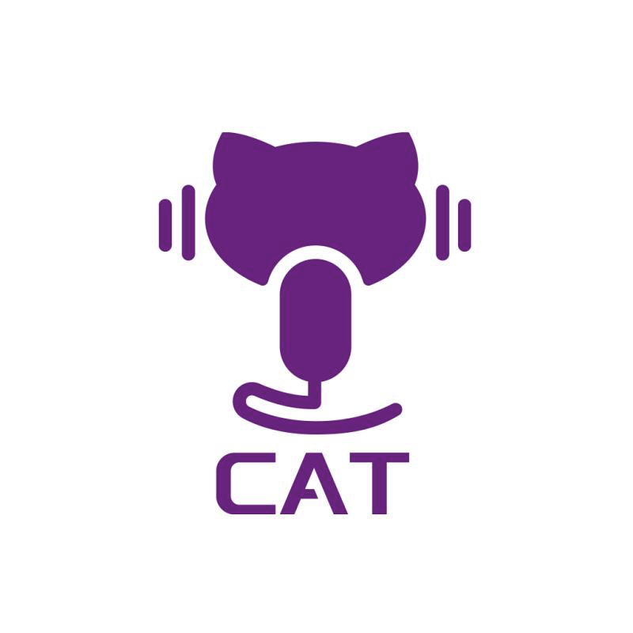

<div align="center"></div>

# CAT: CRF-based ASR Toolkit
**CAT provides a complete workflow for CRF-based data-efficient end-to-end speech recognition.**

- [Overview](#overview)
- [Features](#features)
- [Installation](#installation)
- [Getting started](#getting-started)
- [ASR results](#asr-results)
- [Further reading](#further-reading)

## Overview

CAT aims at combining the advantages of both the hybrid and the E2E ASR approches to achieve data-efficiency, by judiciously examining the pros and cons of modularity versus unified neural network, separate optimization versus joint optimization. CAT advocates global normalization modeling and discriminative training in the framework of [Conditional Random Field](https://en.wikipedia.org/wiki/Conditional_random_field) (CRF), currently with [Connectionist Temporal Classification](https://mediatum.ub.tum.de/doc/1292048/file.pdf) (CTC) inspired state topology.


## Features

1. CAT contains a full-fledged CUDA/C/C++ implementation of CTC-CRF loss function binding to PyTorch.

2. One-stop CTC/CTC-CRF/RNN-T/LM training & inference. See the [templates](egs/TEMPLATE).

3. Flexible configuration with JSON. Check the [guideline for configuration](docs/configure_guide.md).

4. Scalable and extensible. It is easy to be extended to train tens of thousands of speech data and add new models and tasks.


## Installation

1. Dependencies

   - CUDA compatible device, NVIDIA driver installed and CUDA lib available.
   - PyTorch: `>=1.9.0` is required. [Installation guide from PyTorch](https://pytorch.org/get-started/locally/#start-locally)
   - [Kaldi](https://github.com/kaldi-asr/kaldi) **\[optional, but recommended\]**: used for speech data preparation and some FST-related operations. This is optional for most of the basic functions. Required only when you want to conduct [CTC-CRF](egs/TEMPLATE/exp/asr-ctc-crf) training.
      
      Besides Kaldi, you could use `torchaudio` for feature extraction. Take a look at [data.sh](egs/aishell/local/data.sh) for how to prepare data with `torchaudio`.

2. Clone and install CAT

   ```bash
   git clone https://github.com/thu-spmi/CAT.git && cd CAT
   # Get installation helping message
   ./install.sh -h
   # Install with default configurations
   #./install.sh
   ```

## Getting started

To get started with this project, please refer to [TEMPLATE](egs/TEMPLATE/README.md) for tutorial.


## ASR results

| dataset                                                                                                                | evaluation sets         | performance  |
| ---------------------------------------------------------------------------------------------------------------------- | ----------------------- | ------------ |
| [AISHELL-1](egs/aishell#result)                                                                                        | dev / test              | 3.93 / 4.22  |
| [Commonvoice German](https://github.com/thu-spmi/CAT/blob/v2/egs/commonvoice/RESULT.md#conformertransformer-rescoring) | test                    | 9.8          |
| [Librispeech](egs/libri#result)                                                                                        | test-clean / test-other | 1.94 / 4.39  |
| [Switchboard](https://github.com/thu-spmi/CAT/blob/v2/egs/swbd/RESULT.md#conformertransformer-rescoring)               | switchboard / callhome  | 6.9 / 14.5   |
| [THCHS30](https://github.com/thu-spmi/CAT/blob/v2/egs/thchs30/RESULT.md#vgg-blstm)                                     | test                    | 6.01         |
| [Wenetspeech](egs/wenetspeech#result)                                                                                  | test-net / test-meeting | 9.32 / 14.66 |
| [WSJ](egs/wsj/RESULT.md)                                                                                               | eval92 / dev93          | 2.77 / 5.68  |

## Further reading

- [What's New](docs/whatsnew.md)
- [Guideline for configuring settings](docs/configure_guide.md)
- Tutorial for [CUSIDE](https://arxiv.org/abs/2203.16758) based streaming ASR: [English](docs/cuside.md) | [中文](docs/cuside_ch.md)
- [Some tips about the usage of third party tools](docs/guide_for_third_party_tools.md)
- Guide to train models on more than 1500 hours of speech data: [English](docs/how_to_prepare_large_dataset.md) | [中文](docs/how_to_prepare_large_dataset_ch.md)

## Citation

```
@inproceedings{xiang2019crf,
  title={CRF-based single-stage acoustic modeling with CTC topology},
  author={Xiang, Hongyu and Ou, Zhijian},
  booktitle={IEEE International Conference on Acoustics, Speech and Signal Processing (ICASSP)},
  pages={5676--5680},
  year={2019},
  organization={IEEE}
}

@inproceedings{an2020cat,
  title={CAT: A CTC-CRF based ASR toolkit bridging the hybrid and the end-to-end approaches towards data efficiency and low latency},
  author={An, Keyu and Xiang, Hongyu and Ou, Zhijian},
  booktitle={INTERSPEECH},
  pages={566--570},
  year={2020}
}
```
