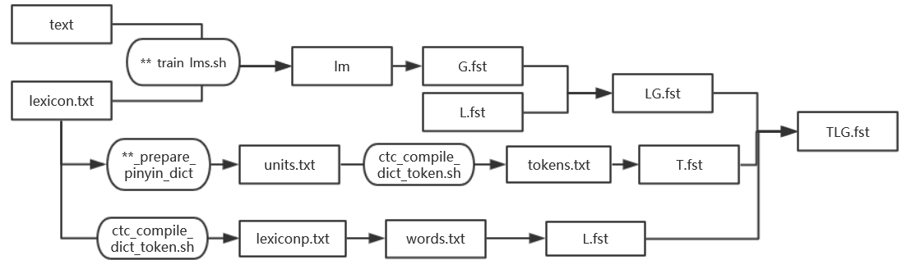
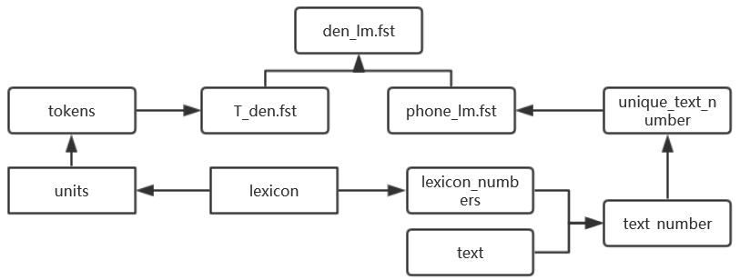
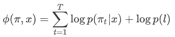

# CAT: Crf-based Asr Toolkit
**CAT provides a complete workflow for CRF-based data-efficient end-to-end speech recognition.**

* [Overview](#Overview)
* [Key Features](#Key-Features)
* [Dependencies](#Dependencies)
* [Installation](#Installation)
* [Toolkit Workflow](#Toolkit-Workflow)

## Overview

Deep neural networks (DNNs) of various architectures have become dominantly used in automatic speech recognition (ASR), which roughly can be classified into two approaches - the DNN-HMM hybrid and the end-to-end (E2E) approaches. DNN-HMM hybrid systems like [Kaldi](http://kaldi-asr.org/) and [RASR](http://www-i6.informatik.rwth-aachen.de/rwth-asr/) achieve the state-of-the-art performance in terms of recognition accuracy, usually measured by word error rate (WER) or character error rate (CER). End-to-end systems[^e2e] (like [Eesen](https://github.com/yajiemiao/eesen) and [Espnet](https://github.com/espnet/espnet)) put simplicity of the training pipeline at a higher priority and usually are data-hungry. When comparing the hybrid and E2E approaches (modularity versus a single neural network, separate optimization versus joint optimization), it is worthwhile to note the pros and cons of each approach, as described in [2].

CAT aims at combining the advantages of the two kinds of ASR systems. CAT advocates discriminative training in the framework of [conditional random field](https://en.wikipedia.org/wiki/Conditional_random_field) (CRF), particularly with but not limited to [connectionist temporal classification]() (CTC) inspired state topology.

The recently developed [CTC-CRF](http://oa.ee.tsinghua.edu.cn/~ouzhijian/pdf/ctc-crf.pdf) (namely CRF with CTC topology)  has achieved superior benchmarking performance with training data ranging from ~100 to ~1000 hours, while being end-to-end with simplified pipeline and being data-efficient in the sense that cheaply available language models (LMs) can be leveraged effectively with or without a pronunciation lexicon.

[^e2e]: End-to-end is in the sense that flat-start training of a single DNN in one stage, without using any previously trained models, forced alignments, or building state-tying decision trees, with or without a pronunciation lexicon.

Please cite CAT using:

[1] Hongyu Xiang, Zhijian Ou. CRF-based Single-stage Acoustic Modeling with CTC Topology. ICASSP, 2019. [pdf](http://oa.ee.tsinghua.edu.cn/~ouzhijian/pdf/ctc-crf.pdf)

[2] Keyu An, Hongyu Xiang. Zhijian Ou. CRF-based ASR Toolkit. arXiv, 2019. [pdf](https://arxiv.org/abs/1911.08747) (More descriptions about the toolkit implementation)

[3] Keyu An, Hongyu Xiang. Zhijian Ou. CAT: A CTC-CRF based ASR Toolkit Bridging the Hybrid and the End-to-end Approaches towards Data Efficiency and Low Latency. INTERSPEECH, 2020. [pdf](http://oa.ee.tsinghua.edu.cn/~ouzhijian/pdf/is2020_CAT.pdf)

## Key Features

1. **CAT contains a full-fledged implementation of CTC-CRF.** 
   * A non-trivial issue is that the gradient in training CRFs is the difference between *empirical expectation* and *model expectation*, which both can be efficiently calculated by the forward-backward algorithm.
   * CAT modifies [warp-ctc](https://github.com/baidu-research/warp-ctc) for fast parallel calculation of the *empirical expectation*, which resembles the CTC forward-backward calculation.
   * CAT calculates the *model expectation* using CUDA C/C++ interface, drawing inspiration from Kaldi's implementation of denominator forward-backward calculation.

2. **CAT adopts PyTorch to build DNNs and do automatic gradient computation, and so inherits the power of PyTorch in handling DNNs.**

3. **CAT provides a complete workflow for CRF-based end-to-end speech recognition.**
   * CAT provides complete training and testing scripts for a number of Chinese and English benchmarks and all the experimental results reported in this paper can be readily reproduced. 
   * Detailed documentation and code comments are also provided in CAT, making it easy to get start and obtain state-of-the-art baseline results even for beginners of ASR.

4. **Evaluation results on major benchmarks such as Switchboard and Aishell show that CAT obtains the state-of-the-art results among existing end-to-end models with less parameters, and is competitive compared with the hybrid DNN-HMM models.**

5. **We add the support of streaming ASR**. To this end, we propose a new method called contextualized soft forgetting (CSF), which combines soft forgetting and context-sensitive-chunk in bidirectional LSTM (BLSTM). With contextualized soft forgetting, the chunk BLSTM based CTC-CRF with a latency of 300ms outperforms the whole-utterance BLSTM based CTC-CRF. See [pdf](http://oa.ee.tsinghua.edu.cn/~ouzhijian/pdf/is2020_CAT.pdf) for details.


## Dependencies

* kaldi
* pytorch 0.4+
* openfst
* python 2.7+ or python3

## Installation

**Step 1.** Copy `src/kaldi-patch/latgen-faster.cc` to `kaldi src/bin`, and compile.

**Step 2.** `cd src/ctc_crf`, and run the commands below:

```
make OPENFST=/path/to/your/openfst
```

For pytorch version 1.0+, use `python setup_1_0.py install` in the `ctc_crf/Makefile`.

**Step 3.** Change the path to kaldi  in `egs/wsj/path.sh` to your local path, taking WSJ experiment as an example.

## Installation with Docker
* see [docker](https://github.com/thu-spmi/CAT/blob/master/docker/README.md) for details.

## Toolkit Workflow

We may have different state topologies in the CRF-based ASR framework. In the following, we take phone-based WSJ experiment as an example to illustrate the **step-by-step workflow** of running [CTC-CRF](http://oa.ee.tsinghua.edu.cn/~ouzhijian/pdf/ctc-crf.pdf) (namely CRF with CTC topology), which has achieved superior benchmarking performance. Character-based workflow is similar. Scripts from other toolkits are acknowledged.

To begin, go to an example directory under the `egs` directory, e.g. `egs/wsj`, and **run.sh** is the top script, which consists of the following steps.

1. [Data preparation](#Data-preparation)
2. [Feature extraction](#Feature-extraction)
3. [Denominator LM preparation](#Denominator-LM-preparation)
4. [Neural network training preparation](#Neural-network-training-preparation)
5. [Model training](#Model-training)
6. [Decoding](#Decoding)
7. [Low latency acoustic modeling](#Low-latency-acoustic-modeling)

### Data preparation

**1) `local/wsj_data_prep.sh`** from Kaldi

Do data preparation.  When completed, the folder `data/train` should contain following files:

```
spk2gender
spk2utt
text
utt2spk
wav.scp
```

**2) `local/wsj_prepare_phn_dict.sh`** from Eesen

Download lexicon files and save in folder `data/local/dic_phn`.

```
units.txt : used to generate T.fst (a WFST representation of the CTC topology) later.
lexicon.txt : used to generate L.fst (a WFST representation of the lexicon) later.
```

**3) `scripts/ctc-crf/ctc_compile_dict_token.sh`** from Eesen

Compile `T.fst` and `L.fst`.

Note that Eesen `T.fst` (created by `utils/ctc_token_fst.py` in Eesen) makes mistakes, as described in the [CTC-CRF paper](http://oa.ee.tsinghua.edu.cn/~ouzhijian/pdf/ctc-crf.pdf). We correct it by a new `scripts/ctc-crf/ctc_token_fst_corrected.py`, which is called by `ctc_compile_dict_token.sh` to create the correct `T.fst`.

**4) `local/wsj_format_local_lms.sh`** from Kaldi

Complie `G.fst` (a WFST representation of the LM used later in ASR decoding) and save in `lang_phn_test_{suffix}`.  The fields in {suffix} could be: tg (3-gram), fg (4-gram), pr (pruned LM), and const (ConstArpa-type LM).

**5) `local/wsj_decode_graph.sh`** from Eesen

Compose `T.fst`、`L.fst`、`G.fst` into `TLG.fst`, which is placed in folder `lang_phn_test_{suffix}`.


Summary of [Data preparation](#Data-preparation): 


### Feature extraction

**1) `utils/subset_data_dir_tr_cv.sh`** from Kaldi

Split train set and dev set in folder `data`. There are two options to split, according to speakers or utterances respectively, configured by `--cv-spk-percent` or `--cv-utt-percent` respectively.

**2) `utils/data/perturb_data_dir_speed_3way.sh`** from kaldi

3-fold data augmentation by perturbing the speaking speed of the original training speech data. The augmented data are postfixed with `sp`,  so as to be differentiated from the original data.

**3) `steps/make_fbank.sh`** from kaldi

Extract filter bank features, and place in folder `fbank`.

**4) `steps/compute_cmvn_stats.sh`** from Kaldi

Compute the mean and variance of features for feature normalization.

### Denominator LM preparation

**1) `scripts/ctc-crf/prep_ctc_trans.py`** from Eesen

The training transcripts are saved in `text` file. Based on lexicon, convert word sequences  in `text` file to label sequences and place in `text_number` file. For example,

```
IT GAVE ME THE FEELING I WAS PART OF A LARGE INDUSTRY 
```

will be converted to

```
38 59 35 32 67 46 41 24 9 34 41 45 37 48 19 68 4 70 55 4 56 59 10 67 9 45 4 56 43 38 47 23 9 57 59 56 40
```

**2) `chain-est-phone-lm`** from Kaldi

Sort the training transcripts in `text_number` file according to head labels in label sequences, remove identical label sequences, and obtain `unique_text_number` file.

Based on `unique_text_number` file, train a phone-based language model `phone_lm.fst` and place in folder `data/den_meta`.

**3) `scripts/ctc-crf/ctc_token_fst_corrected.py`**

Create the correct `T_den.fst`.

**4) `fstcompose`** from Kaldi

Compose `phone_lm.fst` and `T_den.fst` to `den_lm.fst`, and place in folder `data/den_meta`.

Summary of [Denominator LM preparation](#Denominator-LM-preparation): 
  

### Neural network training preparation

For train set, dev set and test set, do the following steps respectively.

**1) apply-cmvn** from Kaldi

Apply feature normalization to the input feature sequence, write to `feats.scp`.

**2) add-deltas** from Kaldi

Calculate the delta features for the input feature sequence.

**3) subsample-feats** from Kaldi

Sub-sample the input feature sequence (default sampling rate: 3).

**4) `path_weight/build/path_weight`**

Note that the potential function (as shown in the [CTC-CRF paper](http://oa.ee.tsinghua.edu.cn/~ouzhijian/pdf/ctc-crf.pdf))

 
 
consists of the denominator LM weight for each training utterance, in addition to the log-softmax weights from the bottom neural neural network.  We need to calculate and save the weight for the label sequence, by the following steps:

- Construct a `linearFST` for each label sequence in `text_number` file;
- Compose the `linearFST` with `phone_lm.fst` to obtain `ofst`.
- Calculate the path weight from `ofst`. 

**5) utils/convert_to_hdf5.py**

Save features, `text_number`, and the corresponding path weights into folder `data\hdf5`(in the format of hdf5 file). This file is used as the input of neural network training.

### Model training

**1) speech_recognition_wsj()**

The main function.

**2) Settings**

| settings     |                                                              |
| ------------ | ------------------------------------------------------------ |
| TARGET_GPUS  | GPU indexes                                                  |
| feature_size | the dimension of the input feature (default :120)            |
| hdim         | the number of units in each hidden layer                     |
| K            | number of neural network output layer. K=#phone+1 for phone-based  model (#char+1 for char-based model.) |
| n_layers     | number of recurrent layers                                   |
| dropout      | dropout ratio (we adopt 0.5 for all our experiments)         |
| optimizer    | default: Adam                                                |
| lr           | the learning rate                                            |

**3) Neural network definition**

The definition of our neural network is in **model.py**. The default model is BLSTM. 

**4) Loss function**

The output of BLSTM is passed through a fully-conneted network (input dim=hdim*2, output dim=K) and a log-softmax layer, which is then used together with the labels to calculate the following loss[^loss] --- Eq (4) in the [CAT paper](https://arxiv.org/abs/1911.08747), by `class CTC_CRF_LOSS` in **ctc_crf.py**.

 

[^loss]: As convention, loss is the negative of log-likelihood.

Note that in the python code, the path weights are not included in the loss for back-propagation because they behave as constants during back-propagation, so we call the loss `partial_loss` for sake of clarity.

The loss function is defined by `class CTC_CRF_LOSS` in **ctc_crf.py**, which calls two functions --- `gpu_ctc` (for the numerator `costs_ctc` calculation) and `gpu_den` (for the denominator `costs_alpha_den` calculation, including  weights for all possible paths). Both functions are implemented with CUDA. The interface definitions for the two functions are in **src\ctc_crf\binding.cpp** and **src\ctc_crf\binding.h**, and the implementations are in **src\ctc_crf\gpu_den** and **src\ctc_crf\gpu_ctc**. For the numerator calculation, we borrowed some codes from [warp-ctc](https://github.com/baidu-research/warp-ctc)。

`costs_ctc` and `costs_alpha_den` are used to calculate the `partial_loss` as follows: 

```
(- costs_ctc + costs_alpha_den) - lamb * costs_ctc
```

where `lamb` is the weight for the CTC Loss, which is employed to stabilize the training.

### Decoding

**1) calculate_logits.py**

Do inference over the test set, using the trained model. The outputs of the network are saved in the format of ark files in folder `decode_{}/ark`.

**2) decode.sh**

Consists of two steps : **latgen-faster** and **score.sh**:

- **latgen-faster** from Eesen
  - Generating lattices, by using `TLG.fst` and the outputs of the network (`decode.{}.ark`). Lattices  are saved as `lat.gz` file in `exp/decode_${dataset}/lattice_$lmtype`.

- **score.sh** from Eesen
  - **lattice-scale**: Scale the lattice with different acoustic scales.                                                                                                                                                                                   
  - **lattice-best-path**: Find the best path in the generated lattice.
  - **compute-wer**: Compute the WER.

**3) lmrescore_const_arpa.sh** from  Kaldi

Rescore the lattice with ConstArpa-type language model.

**4) lmrescore.sh** from Kaldi

Rescore the lattice with fst-type language model.

### Low latency acoustic modeling

**1) scripts/ctc-crf/convert_to_hdf5_chunk.py**

Split an utterance into non-overlapping chunks.

**2) ChunkBLSTM_with_Context in scripts/ctc-crf/model.py**

For each chunk, a fixed number of frames to the left and right of the chunk are appended as contextual frames.

The hidden and cell states of the forward and backward LSTM networks are reset to zeros at the left and right boundaries of each CSC in both training and inference. 

When calculating the sequence-level loss in CTC-CRF, we splice the neural network output from chunks into a sequence again, but excluding the network outputs from contextual frames.

**3) scripts/ctc-crf/train_chunk_context.py and scripts/ctc-crf/train_dist_chunk_context.py**

A pre-trained fixed whole-utterance BLSTM is used to regularize the hidden states of the CSC-based BLSTM, and the overall training loss is the sum of the CTC-CRF loss and the twin regularization loss with a scaling factor. 


**4) scripts/ctc-crf/calculate_logits_chunk_context.py**

Once the CSC-based BLSTM is trained, we can discard the whole-utterance BLSTM and perform inference over testing utterances without it.
