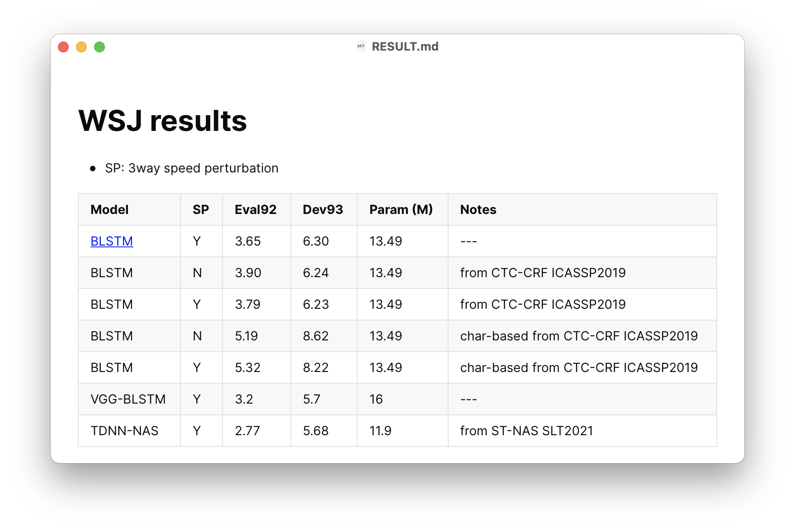

## To begin with

* For easy maintenance of experiments and enforcing the reproducibility, this guideline introduces our **strongly recommend** way of conducting experiments using **CAT**.
* We (and PyTorch officially) recommend to use DistributedDataParallel (DDP) instead of DataParallel.
* In this guideline, we take the experiment on the *Wall Street Journal* dataset as an example, which works at directory `CAT/egs/wsj` unless otherwise stated.

## File tree

```
.
├── cmd.sh
├── ctc-crf -> ../../scripts/ctc-crf
├── conf
│   └── ...
├── data
│   └── ...
├── exp
│   └── ...
├── local
│   └── ...
├── path.sh
├── run.sh
├── RESULT.md
├── steps -> /opt/kaldi/egs/wsj/s5/steps
└── utils -> /opt/kaldi/egs/wsj/s5/utils
```

`exp/` dir is what we care about. 

In this dir, you define your own experiments as sub-directories, liked `exp/<myexp1>`, `exp/<myexp2>`, etc. Inside the experiment dir, the files and their meanings are as follows:

```
exp/myexp/
├── ckpt            # auto-gen, containing training checkpoint, log files.
│   └── ...
├── config.json     # the configuration file, you need to manually create it.
├── monitor.png     # auto-gen, visualization of log files.
├── readme.md       # would be auto-gen if not exist, you can add comments in it.
└── scripts.tar.gz  # auto-gen, archive of all scripts running current experiment.
```

## Workflow

1. Create dir `exp/myexp` and configuration file `exp/myexp/config.json` (See [HOWTO](#howto-config)).
2. In `run.sh`, set the variable `dir=exp/myexp` and other arguments (`--seed`, `--batch_size`, etc.), which are passed to training script `train.py`.
4. Run `./run.sh`. If everything goes well, go to next step.
5. Manually add the WER results into the section of WER in `exp/myexp/readme.md` (See [HOWTO](#howto-sr-readme)).
6. [OPTIONAL] If this running of experiment gives some significant results, add them to the result page `RESULT.md` (In our example, it is `CAT/egs/wsj/RESULT.md`, See [HOWTO](#howto-sup-readme)).
7. [OPTIONAL] Commit your results and publish to GitHub. Add the directory `exp/myexp` to be tracked, but exclude large checkpoint and log files in `exp/myexp/ckpt`. Feel free to make a pull-request.

## HOWTO

### Configure RESULT.md<a name='howto-sup-readme'></a>

We don't place any restriction to RESULT.md.

It is a good practice to include a well-maintained results table as follows:

### Configure readme.md for a single-running experiment<a name='howto-sr-readme'></a>

As we mentioned, this file can be auto-generated, but there are still something you need to manually fill in. The auto-generated one looks like:


Paste the results you get in the **WER** block.

Add anything you think is helpful in **Appendix**. Although most of the details are included in `config.json` and `scripts.tar.gz`, additional information for people to understand your experiments, like those in the following, is encouraged.

* WHY you conduct this experiment.
* WHAT improvement you make compared to previous experiments.
* \[OPTIONAL\] HOW others can reproduce your experiment. Please add necessary details if you use any ad-hoc trick beyond the configuration file `config.json` and archived files `scripts.tar.gz`.

### Configure json file<a name='howto-config'></a>

Normally, we name the json file as `config.json`.  It contains all the arguments to construct the model, the optimizer and the learning rate scheduler.

```json
{
    "net": {
        "type": "BLSTM",
        "lossfn": "crf",
        "lamb": 0.01,
        "kwargs": {
            "n_layers": 6,
            "idim": 120,
            "hdim": 256,
            "num_classes": 72,
            "dropout": 0.5
        }
    },
    "scheduler": {
        "type": "SchedulerEarlyStop",
        "optimizer": {
            "type_optim": "Adam",
            "kwargs": {
                "lr": 1e-3,
                "betas": [
                    0.9,
                    0.99
                ],
                "weight_decay": 0.0
            }
        },
        "kwargs": {
            "epoch_min": 0,
            "lr_stop": 1e-5,
            "reverse_metric_direc": true
        }
    }
}
```

