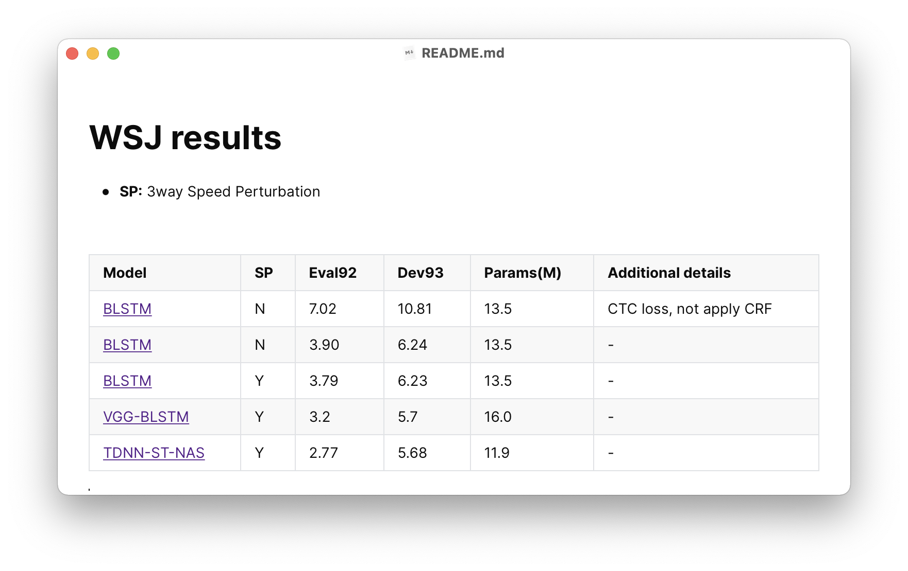

## To begin with

* For well maintaining of experiments and assuring the reproduciblity,  this guideline introduces our **strongly recommened** way of conducting experiments using **CAT**.
* We (and PyTorch officially) recommend  to use DistributedDataParallel (DDP) instead of DataParallel.
* In this guideline, we take the *Wall Street Journal* dataset as example, and working at directory `CAT/egs/wsj` if no other statement.

## File tree

```
.
├── cmd.sh
├── ctc-crf -> ../../scripts/ctc-crf
├── conf
│   └── ...
├── data
│   └── ...
├── exp
│   └── ...
├── local
│   └── ...
├── path.sh
├── run.sh
├── README.md
├── steps -> /opt/kaldi/egs/wsj/s5/steps
└── utils -> /opt/kaldi/egs/wsj/s5/utils
```

`exp/` dir is what we care about. 

In this dir, we define our own experiments as sub-directories, liked `exp/<myexp1>`, `exp/<myexp2>`, etc. Inside the experiment dir, files tree and their meaning are

```
exp/myexp/
├── ckpt	# auto-gen, containing training checkpoint, log files.
│   └── ...
├── config.json			# the configuration file, you need to manually create it.
├── monitor.png			# auto-gen, visualization of log files.
├── readme.md				# would be auto-gen if not exist, you can add comments in it.
└── scripts.tar.gz	# auto-gen, archive of all scripts running current experiment.
```

## Workflow

1. Create dir `exp/myexp` and configuration file `exp/myexp/config.json` (See [HOWTO](#howto-config)).
2. In `run.sh`, set the variable `dir=exp/myexp` and other arguments parsed to training script (`--seed`, `--batch_size`, etc.).
3. Assure the training script is `train_v2.py` in `run.sh`.
4. Run `./run.sh`. If everything goes well, go to next step.
5. Manually add the WER results into section WER of `exp/myexp/readme.md` (See [HOWTO](#howto-sr-readme)).
6. [OPTIONAL] If this running of experiment gets some significant results, add them in the sup-result page `README.md` (In our example, it is `CAT/egs/wsj/README.md`, See [HOWTO](#howto-sup-readme)).
7. [OPTIONAL] Commit your results and publish to GitHub. Add the directory `exp/myexp` excluding large checkpoint and log files in `exp/myexp/ckpt` to be tracked. Feel free to make a pull-request.

## HOWTO

### Configure sup README<a name='howto-sup-readme'></a>

We don't place any restriction to this file. You can consider it as the `result` file of Kaldi. 

A well-maintained results table is better.

### Configure single-running readme<a name='howto-sr-readme'></a>

As we mentioned, this file can be auto-generated, but there are still something you need to manually fill in. The auto-generated one looks like


Paste the results you get in **WER** blank.

Add anything you think is helpful in **Appendix**. Though most of the details are included in `config.json` and `scripts.tar.gz`, additional information helping people understand is encouraged.

* WHY you conduct this experiment.
* WHAT improvement you make compared to previous experiment.
* \[OPTIONAL\] HOW others reproduce your experiment if you use any ad-hoc trick beyond the configuration file `config.json` and archived files `scripts.tar.gz`.

### Configure json file<a name='howto-config'></a>

Normally, we name the json file `config.json`.  It contains all arguments to construct model, optimizer and learning rate scheduler.

```json
{
    "net": {
        "type": "myBLSTM",
        "lossfn": "crf",
        "lamb": 0.01,
        "kwargs": {
            "n_layers": 6,
            "idim": 120,
            "hdim": 256,
            "num_classes": 72,
            "dropout": 0.5
        }
    },
    "scheduler": {
        "type": "SchedulerEarlyStop",
        "optimizer": {
            "type_optim": "Adam",
            "kwargs": {
                "lr": 1e-3,
                "betas": [
                    0.9,
                    0.99
                ],
                "weight_decay": 0.0
            }
        },
        "kwargs": {
            "epoch_min": 0,
            "lr_stop": 1e-5,
            "reverse_metric_direc": true
        }
    }
}
```

