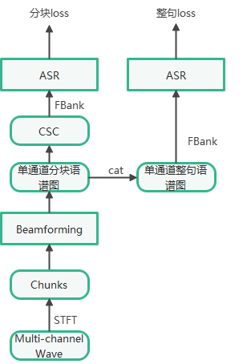

# 多通道端到端流式语音识别

**本文档介绍如何使用多通道端到端语音识别 (ME2E ASR) 框架进行多通道端到端流式语音识别任务**

*相关文献：*

>*1.Ochiai, Tsubasa, et al. "Multichannel end-to-end speech recognition." International conference on machine learning. PMLR, 2017.<br>
2.Keyu An, Hongyu Xiang, Zhijian Ou:
"CAT: A CTC-CRF Based ASR Toolkit Bridging the Hybrid and the End-to-End Approaches Towards Data Efficiency and Low Latency." INTERSPEECH 2020: 566-570 <br>
3.Keyu An, Huahuan Zheng, Zhijian Ou, Hongyu Xiang, Ke Ding, Guanglu Wan."CUSIDE: Chunking, Simulating Future Context and Decoding for Streaming ASR."INTERSPEECH, 2022*

实验参考了单通道端到端语音识别中的egs/aishell/ctc-v1实验，前端网络程序位于文件夹cat/front下

**本文档将从以下步骤说明前期数据准备与ME2E 流式ASR相关的参数配置**

+ 多通道端到端流式语音识别
  + 框架讲解
  + 代码说明
  + 数据准备
  + 训练与测试

## 框架讲解

多通道端到端语音识别框架由三部分组成：<br>
- 多通道语音信号处理 -> 特征转换 -> 语音识别<br>

下面我们分别介绍：

**1、多通道语音信号处理**：

本实验中使用基于mask的波束形成方法进行多通道语音信号处理，该方法使用BLSTM网络来估计单通道的语音和噪声掩码，接着在通道轴上进行平均，得到单通道的掩码，用单通道的掩码计算语音和噪声的空间协方差矩阵，进而估计波束形成滤波器系数，最后进行波束形成，得到增强后的单通道语音，其流程图如下所示：

  <div align="center">
    
  </div>

  + T-F掩码估计：

    通过两个神经网络估计信号和噪声的掩码，其中Xc是(B,T,F,C)的矩阵，分别代表(batch size, time, frequency, channels)

    $$\mathbf{m}_{\text{S}}(c) = \text{BLSTM}\left( \lvert \mathbf{X}(c) \rvert \right) $$

    $$\mathbf{m}_{\text{N}}(c) = \text{BLSTM}\left( \lvert \mathbf{X}(c) \rvert \right) $$

    $$\mathbf{x}^{\dagger}(t, f)$$

  + 跨通道功率谱密度估计

    $$\boldsymbol{\Phi}_{\mathrm{SS}}(f) =\frac{1}{\sum_{t=1}^T m_S(t, f)} \sum_{t=1}^T m_S(t, f) \mathbf{x}(t, f) \mathbf{x}^{\dagger}(t, f) $$

    $$\boldsymbol{\Phi}_{\mathrm{NN}}(f) = \frac{1}{\sum_{t=1}^T m_N(t, f)} \sum_{t=1}^T m_N(t, f) \mathbf{x}(t, f) \mathbf{x}^{\dagger}(t, f)$$
    
    其中 $\mathbf{x}(t, f)=\{x(t, f, c)\}_{c=1}^C \in \mathbb{C}^C, \mathrm{~T}$ 是输入特征的长度, $m_S(t, f) \in[0,1]$ 是语音信号的时频掩模 (time-frequency mask) , $m_N(t, f) \in[0,1]$ 是噪声信号的时频掩模, 通过如下方式得到，其中 $m_S(t, f)$ 和 $m_N(t, f)$ 是分别估计得到的, 两者的加和并不一定等于1:

  $$ m_S(t, f) = \frac{1}{C} \sum_{c=1}^C m_S(t, f, c) $$

  $$ m_N(t, f) = \frac{1}{C} \sum_{c=1}^C m_N(t, f, c) $$
   

  + MVDR波束成形

    MVDR 通过对多阵列接收信号应用线性滤波器来降低噪声干扰并恢复信号分量:
    $$\hat{x}(t, f)=\sum_{c=1}^c h(f, c) \times x(t, f, c)$$
    其中 $x(t, f, c)$ 是第 $c$ 个麦克风接收信号的短时傅立叶变换在时刻 $t$ 和频点 $f$ 处的取值, $\hat{x}(t, f)$ 是增强后的信号在时刻 $t$ 和频点 $f$ 处的取值, $x(t, f, c)$ 和 $\hat{x}(t, f)$ 的取值均为复数, $\mathrm{C}$ 是麦克风个数。 $h(f, c)$ 是对应第 $\mathrm{c}$ 个麦克风的时不变（time invariant）滤波器系数在频点 $f$ 处的取值。MVDR 通过求解最小方差无失真响应(minimum variance distortionless response) 得到波束成形滤波器系数 $\mathbf{h}(f)=\{h(f, c)\}_{c=1}^C \in \mathbb{C}^C$ :

    $$ \mathbf{h}(f)=\frac{\boldsymbol{\Phi}_{\mathrm{NN}}^{-1}(f) \boldsymbol{\Phi}_{\mathrm{SS}}(f)}{\mathrm{tr}\left\{\boldsymbol{\Phi}_{\mathrm{NN}}^{-1}(f) \boldsymbol{\Phi}_{\mathrm{SS}}(f)\right\}} \mathbf{u} $$ 

    其中:

    $\boldsymbol{\Phi}_{\mathrm{SS}}(f)$ 是信号的跨通道功率谱密度矩阵,

    $\boldsymbol{\Phi}_{\mathrm{NN}}(f)$ 是噪声的跨通道功率谱密度矩阵,

    $\mathbf{u}$ 是参考麦克风的 one-hot 向量，本方法默认选取第一个麦克风作为参考麦克风，
    
    $\mathrm{tr}$ 是矩阵求迹的操作。


**2、特征转换**：将语谱图特征转换为Fbank特征

**3、语音识别**：使用Comformer网络进行语音识别，此处不再赘述，有关流式语音识别的相关知识请参考[cuside_ch.md](https://github.com/thu-spmi/CAT/blob/master/docs/cuside_ch.md)


## 代码说明

核心代码位于```cat/ctc/train_me2e.py```与```cat/ctc/train_me2e_chunk.py```，关于流式的参数设置可参考[cuside_ch.md](https://github.com/thu-spmi/CAT/blob/master/docs/cuside_ch.md)，现主要介绍下有关前端和特征转换的参数配置：

+ n_fft：进行STFT变换时的点数
+ win_length：进行STFT变换时的窗长
+ hop_length：进行STFT变换时的跳长
+ idim：梅尔滤波器组的数量
+ beamforming：使用的滤波器类型，默认为"mvdr"
+ wpe：是否使用去混响
+ ref_ch：进行波束形成时的参考信道，默认使用第一个通道，当为"-1"时，使用注意力机制去选择参考信道

## 数据准备

本文档中实验选择开源的Aishell4数据作为实验数据，这些开源数据可以直接下载得到。下载好的数据由音频及训练、验证、测试文本构成。将train_S、train_M、train_L合成为一个train文件夹。
准备完成后，执行命令：

```bash
bash local/data_multi.sh -subsets train dev test -datapath /path/to/aishell4 
bash local/audio2ark_multi.sh train dev test --res 16000
```

其中：

+ data_multi.sh：用于提取Aishell4中无重叠说话人的片段，放在Aishell4目录下，进行数据集划分，将其划分为train dev test，dev与train的比例为1：20，最后生成wav.scp与text文件，放在data/src对应的文件夹中
+ audio2ark_multi.sh：用于将波形文件转换为特征文件，并生成.ark文件

更多的细节可以通过执行：

```bash
bash local/data_multi.sh -h
bash local/audio2ark_multi.sh -h
```

来获取其使用方法

## 训练与测试

参考cuside的训练方法，流式模型和非流式模型进行参数共享和联合训练。对于每一条样本，会分别按流式方式和非流式方式进行识别并计算对应的loss，框架结构如下所示：

  <div align="center">
    
  </div>

多通道的语音波形首先进行STFT变换，得到语谱图特征，进行分块处理后，送入到波束形成网络，得到单通道的分块语谱图，接着将单通道的分块语谱图拼接，得到单通道的整句语谱图，分别计算Fbank特征后，得到整句的loss，在计算分块loss前，可以进行模拟未来操作，然后送入到ASR网络，计算得到分块loss

该代码位于```cat/ctc/train_me2e_chunk.py```下

在进行测试时：

+ 非流式过程使用```model.beamforming()```与```model.encoder()```来进行识别
+ 流式过程使用```model.bf_chunk_infer()```来进行流式的识别

流式的训练和测试的过程与cuside中的区别相同