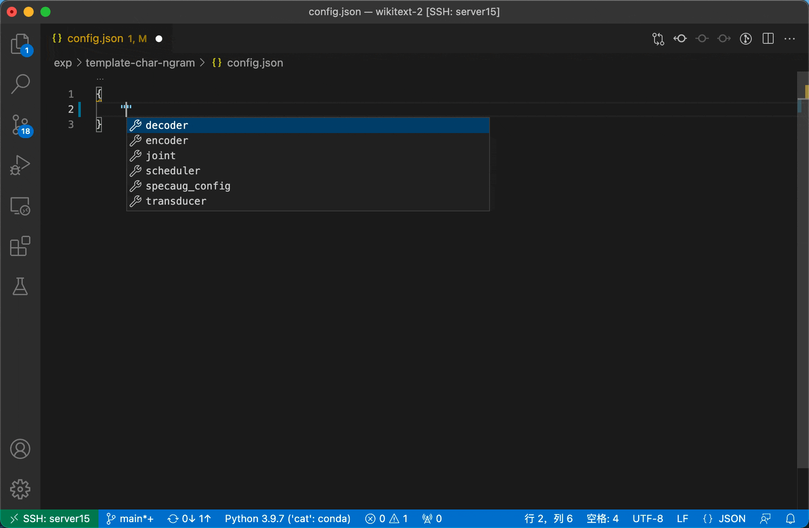

# Configuration

Basically, we use two files to control the whole pipeline of **data-preparation / tokenizer training / model training / evaluation**, which commonly look like

```
egs/[task]/exp/template
├── config.json
└── hyper-p.json
```

## Hyper-parameter configuration

`hyper-p.json`, example taken from `egs/libri`

```
{
    // data pre-processing related
    "data": {
        "train": ...,
        "dev": ...,
        "test": ...,
        // "filter" is for ASR task only, filter out utterances shorter than 10 and longer than 2000 (frames)
        "filter": "10:2000",
        // "packing-text-lm" is for LM task only. code: cat/utils/data/pack_corpus.py
        "packing-text-lm": {
            // e.g. truncate the utterances by 128 (tokens)
            "truncate": 128
        }
    },
    "tokenizer": {
        "type": ...,          // can be any class derived from 'AbsTokenizer' in cat/shared/tokenizer.py
        "file": ...,          // Path to the tokenizer file.
        "option-train": ...,
        "option-init": ...
    },
    // environment settings, this is on top of all other settings.
    "env": {
        // for example, specify to use GPU0 and GPU1
        "CUDA_VISIBLE_DEVICES": "0,1"
    },
    // NN training related setting:
    "train": {
        "bin": ...          // any module with main() and _parser() function.
                            // e.g. cat.ctc.train | cat.rnnt.train | cat.lm.train
        "option": ...       // options to the module
    },
    // inference related setting
    "inference": {
        // model averaging setting, optional
        "avgmodel": {
            "mode": "best",  // 'best' of 'last'
            "num": 10        // number of checkpoints to be averaged
        },
        "infer": {
            "bin": ...       // inference module interface
                             // e.g. cat.ctc.decode | cat.rnnt.decode | cat.lm.ppl_compute
            "option": ...    // options to the module
        },
        "er": ...            // check cat/utils/wer.py for supported options.
    },
    // the git commit hash, useful to reproduce the experiment
    "commit": "60aa5175c9630bcb5ea1790444732fc948b05865"
}
```

## Model configuration

`config.json`, example taken from `egs/libri`

```
{
    // spec augument settings, for ASR only, code: cat/shared/specaug.py
    "specaug": {
        ...
    },
    // trainer settings, optional for some tasks, code: `build_model()` function according to your hyper:train:bin script.
    "trainer": {
        ...
    },
    // joint net settings, required for RNN-T, code: cat/rnnt/joiner.py
    "joiner": {
        "type": ...,   // can be any class derived from 'AbsJointNet' in cat/rnnt/joiner.py
        "kwargs": {    // arguments according to 'type'
            ...
        }
    },
    // audio encoder settings, required for ASR task, code: cat/shared/encoder.py
    "encoder": {
        "type": ...,   // can be any class derived from 'AbsEncoder' in cat/shared/encoder.py
        "kwargs": {    // arguments according to 'type'
            ...
        }
    },
    // decoder settings, required for both RNN-T and LM tasks, code: cat/shared/decoder.py 
    "decoder": {
        "type": ...,   // can be any class derived from 'AbsDecoder' in cat/shared/decoder.py 
        "kwargs": {    // arguments according to 'type'
            ...
        }
    },
    // scheduler settings, required for all NN model training. code: cat/shared/scheduler.py
    "scheduler": {
        "type": ...,   // can be any class derived from `Scheduler` in cat/shared/scheduler.py
        "kwargs": {    // arguments according to 'type'
            ...
        },
        // optimizer settings
        "optimizer": {
            "type": ...,       // all available ones in torch.optim
            "kwargs": {        // arguments according to 'type'
                ...
            }
        }
    }
}
```

## Usage with Visual Studio Code

If you're using [Visual Studio Code](https://code.visualstudio.com/) as working environment, you can setup the json schema for syntax intellisense via (in `egs/[task]/`):

```bash
ln -s ../../.vscode ./
```

Above command would probably raise an error, if there exists a directory `egs/[task]/.vscode`, in such situation, you could manually copy the schema files

```bash
cp ../../.vscode/{sgm_hyper,sgm_nn}.json ./.vscode/
```

And add following contents into the file `egs/[task]/.vscode/settings.json`:

```
{
    ...,        // there might be existing settings
    "json.schemas": [
        {
            "fileMatch": [
                "exp/**/config.json"
            ],
            "url": ".vscode/sgm_nn.json"
        },
        {
            "fileMatch": [
                "exp/**/hyper-p.json"
            ],
            "url": ".vscode/sgm_hyper.json"
        }
    ]
}
```

With all these properly setup, intellisense will be enable when editting `exp/[any]/config.json` and `exp/[any]/hyper-p.json`.



For more about how schema works, refer to [JSON editing in Visual Studio Code](https://code.visualstudio.com/docs/languages/json).
