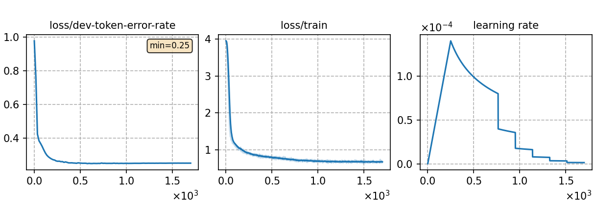

### Basic info

**This part is auto-generated, add your details in Appendix**

* \# of parameters (million): 17.91
* GPU info \[2\]
  * \[2\] NVIDIA GeForce RTX 3090

### Notes

* 

### Result
```
test_id_char    %SER 99.31 | %PER 20.51 [ 23281 / 113495, 59 ins, 3214 del, 20008 sub ]

```

|     training process    |
|:-----------------------:|
||
