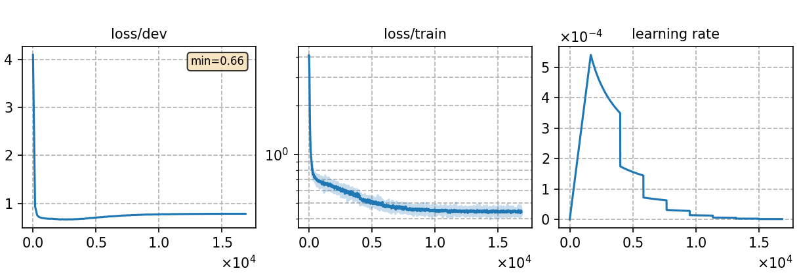

### Basic info

**This part is auto-generated, add your details in Appendix**

* \# of parameters (million): 17.91
* GPU info \[2\]
  * \[2\] NVIDIA GeForce RTX 3090

### Notes

* 

### Result
```
test_pl_char    %SER 99.17 | %PER 24.14 [ 72078 / 298549, 16064 ins, 31127 del, 24887 sub ]
dev_pl_char     %SER 99.46 | %PER 22.64 [ 78622 / 347344, 16696 ins, 35125 del, 26801 sub ]
```

|     training process    |
|:-----------------------:|
||
