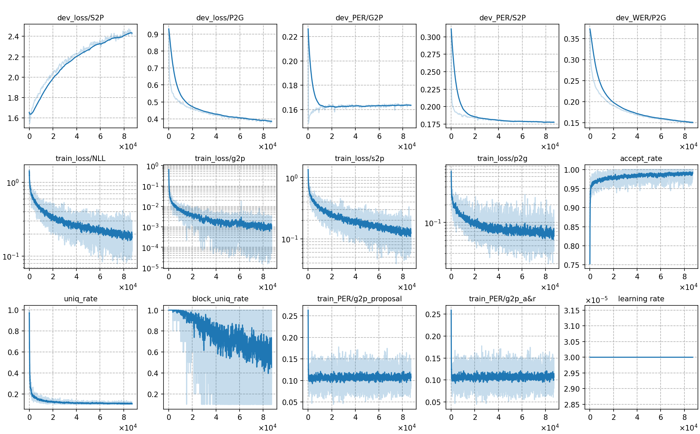

### Basic info

**This part is auto-generated, add your details in Appendix**

* \# of parameters (million): 126.03
* GPU info \[10\]
  * \[10\] NVIDIA GeForce RTX 3090

### Notes

Before starting JSA-SPG training, the following three initialization trainings need to be completed:
- **[S2P](../../s2p_exp/Whistle_phone_ft_polish_100utts/):** Fine-tune Whistle (90M) on 10minutes of polish data. After training, pseudo-labels are generated on the 130-hour training set.
- **[P2G](../../p2g_exp/P2G_polish_with_100utts_S2P_result/):** Train the P2G model from scratch using the pseudo-labels generated by the S2P model.
- **[G2P](../../g2p_exp/G2P_polish_with_100utts_S2P_result/):** Train the G2P model from scratch using the pseudo-labels generated by the S2P model.

### Result
```
# without LM
test_pl %SER 24.09 | %WER 8.19 [ 4873 / 59464, 481 ins, 834 del, 3558 sub ]

# with LM
test_pl_ac1.0_lm1.2_wip0.0.hyp  %SER 13.48 | %WER 4.65 [ 2764 / 59464, 204 ins, 593 del, 1967 sub ]

# MLS decoding "LM_weight": 0.5
test_pl %SER 11.22 | %WER 3.93 [ 2339 / 59464, 255 ins, 344 del, 1740 sub ]

S2P PER
test_pl %SER 96.80 | %PER 17.35 [ 51787 / 298418, 16922 ins, 21035 del, 13830 sub ]
```

|     training process    |
|:-----------------------:|
||
