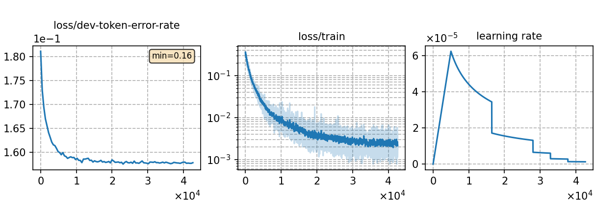

### Basic info

**This part is auto-generated, add your details in Appendix**

* \# of parameters (million): 18.15
* GPU info \[8\]
  * \[8\] NVIDIA GeForce RTX 3090

### Notes

* 

### Result
```
test_pl_VoxPopuli_jsa_s2p       %SER 89.65 | %WER 28.87 [ 9973 / 34550, 945 ins, 2242 del, 6786 sub ]

# SPG-JSA  decoding
test_pl_VoxPopuli       %SER 89.65 | %WER 28.87 [ 9973 / 34550, 945 ins, 2242 del, 6786 sub ]
test_pl_VoxPopuli_ac1.0_lm1.6_wip0.0.hyp        %SER 90.82 | %WER 23.84 [ 8236 / 34550, 684 ins, 2502 del, 5050 sub ]

# MLS decoding with "LM_weight": 0.3
test_pl_VoxPopuli       %SER 87.97 | %WER 20.57 [ 7106 / 34550, 600 ins, 2219 del, 5287 sub ]
```

|     training process    |
|:-----------------------:|
||
