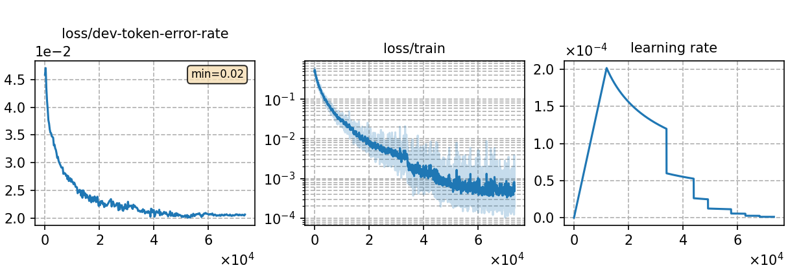

### Basic info

**This part is auto-generated, add your details in Appendix**

* \# of parameters (million): 18.15
* GPU info \[4\]
  * \[4\] NVIDIA GeForce RTX 3090

### Notes

* 

### Result
```
test_id_jsa_s2p %SER 13.24 | %WER 4.55 [ 986 / 21685, 94 ins, 151 del, 741 sub ]

# SPG-JSA  decoding
test_id %SER 13.24 | %WER 4.55 [ 986 / 21685, 94 ins, 151 del, 741 sub ]
test_id_ac1.0_lm1.8_wip0.0.hyp  %SER 8.84 | %WER 2.92 [ 633 / 21685, 26 ins, 184 del, 423 sub ]

# MLS decoding with "LM_weight": 0.9
test_id %SER 6.85 | %WER 2.31 [ 501 / 21685, 22 ins, 109 del, 370 sub ]
```

|     training process    |
|:-----------------------:|
||
