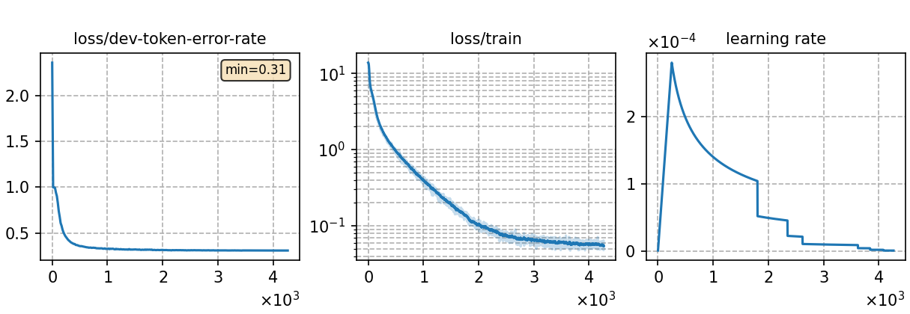

### Basic info

**This part is auto-generated, add your details in Appendix**

* \# of parameters (million): 18.15
* GPU info \[2\]
  * \[2\] NVIDIA GeForce RTX 3090

### Notes

* 

### Result
```
test_id_s2p  %SER 74.85 | %WER 33.58 [ 7282 / 21685, 722 ins, 1024 del, 5536 sub ]
```

|     training process    |
|:-----------------------:|
||
