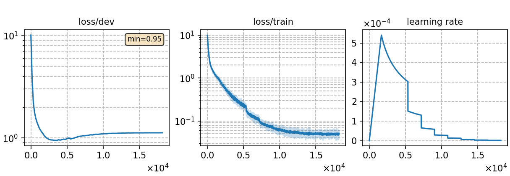

### Basic info

**This part is auto-generated, add your details in Appendix**

* \# of parameters (million): 18.15
* GPU info \[2\]
  * \[2\] NVIDIA GeForce RTX 3090

### Notes

* 

### Result
```
test_pl_s2p  %SER 70.18 | %WER 31.55 [ 18763 / 59464, 1687 ins, 2884 del, 14192 sub ]
```

|     training process    |
|:-----------------------:|
||
