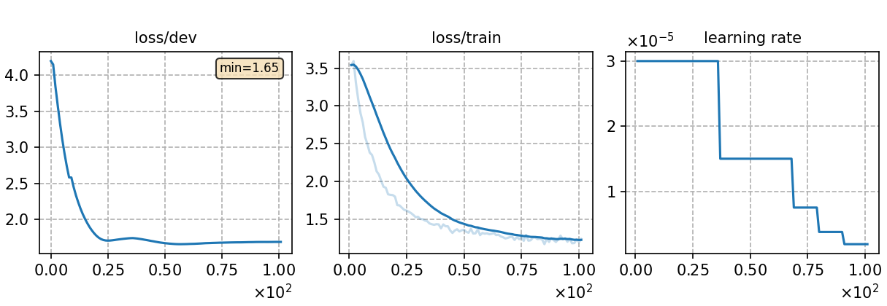

### Basic info

**This part is auto-generated, add your details in Appendix**

* \# of parameters (million): 89.98
* GPU info \[1\]
  * \[1\] NVIDIA GeForce RTX 3090


### Result
```
dev_pl  %SER 99.87 | %PER 31.11 [ 108060 / 347344, 19098 ins, 37694 del, 51268 sub ]
test_pl %SER 99.67 | %PER 32.22 [ 96149 / 298418, 17505 ins, 32156 del, 46488 sub ]
```

|     training process    |
|:-----------------------:|
||
