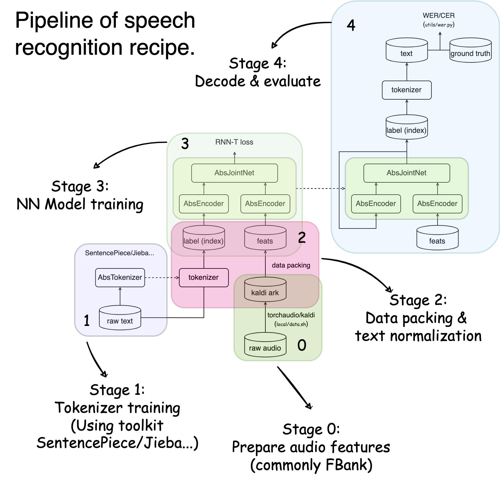

# TEMPLATE

Here are some toy examples you can finish in minutes. But before starting on larger datasets like Librispeech, it is recommended to read through the [Training pipeline](#training-pipeline) to understand what is done at each stage.

## Run templates

### Speech recognition

Prepare `yesno` data:

```bash
bash local/data.sh
```

- Train Transducer (RNN-T)

   ```bash
   python utils/pipeline/asr.py exp/asr-rnnt --ngpu 1
   ```

- RNN-T + [CUSIDE](../../docs/cuside_ch.md)

   Note that a very critical argument for CUSIDE setting is the `downsampling_ratio` in [configuration](exp/asr-rnnt-cuside/config.json). There's no such a autonomous way that the program could recognize the downsampling ratio, therefore you need to configure it according to your encoder setting.

   ```bash
   python utils/pipeline/asr.py exp/asr-rnnt-cuside --ngpu 1
   ```

- Train CTC

   ```bash
   python utils/pipeline/asr.py exp/asr-ctc --ngpu 1
   ```

- Train CTC-CRF. CTC-CRF is somewhat more complex than vanilla CTC. Please refer to the `run.sh` for usage.

   ```bash
   bash exp/asr-ctc-crf/run.sh 
   ```

### Language model

Prepare `ptb` data:

```bash
bash local/lm_data.sh
```

- Train a Transformer LM

   ```bash
   python utils/pipeline/lm.py exp/lm-nn --ngpu 1
   ```


- Train a 3-gram word LM

   ```bash
   bash utils/pipeline/ngram.sh exp/lm-ngram-word -o 3
   ```

## Training pipeline

Both ASR (RNN-T/CTC) and LM pipelines include 4 stages:

```
(data prepare) ->
tokenizer training -> data packing -> nn training -> inference
```

Where for ASR pipeline, the inference is the stage of decoding, and that for LM is the stage of calculating perplexity. Pipeline for n-gram training is kind of special, since there is no NN model and all operations are conduct on CPUs. Therefore, the "nn training" stage for n-gram pipeline is replaced by KenLM (the n-gram training tool) `lmplz` trainining.

Note that data prepare is not included in standard pipelines. It's your duty to prepare the data in proper format in my design. I recommend to implement this part in the file `local/data.sh` (in fact, I've already made that for several recipes), so others can easily reproduce your experiments. Here is an illustration of RNN-T pipeline:

<p align="center">
   
</p>

**What is done at each stage**

0. Speech data preparation. As I mentioned, data preparation is your job. I do not take care of that. To begin with preparing a dataset yourself, please have a look at the [yesno](./local/data.sh) for a toy example prepare data with `torchaudio`.

   For a more meaningful example, please refer to [aishell](../aishell/README.md) for preparing data with `torchaudio` or `kaldi` (if you've kaldi installed). If you already have data in Kaldi standard format (`.scp` for feats and a text transcription file.), you can add the path to `egs/[task]/data/metainfo.json` as following:
   ```json
   {
      "libri-960": {
         "scp": "/path/to/libri-960.scp",
         "trans": "/path/to/libri-960.txt"
      },
      "wsj": {
         "scp": "/path/to/wsj.scp",
         "trans": "/path/to/wsj.txt"
      }
   }
   ```

1. tokenizer training: we train the tokenizer with the training corpus (what you specified in `hyper['data']['train']`, `hyper` is the content in hyper-parameter setting file, which is defaultly `hyper-p.json`) and the tokenizer setting (in `hyper['tokenizer']`).
   The trained tokenizer would be stored as `/path/to/tokenizer.tknz` if you don't specify the path, and can be loaded directly via

   ```python3
   import cat.shared.tokenizer as tknz
   tokenizer = tknz.load('path/to/tokenizer.tknz')
   ```

2. data packing: in short, at this stage, we pack the raw data (e.g. spectrum features or raw texts) into python readable objects (audio spectrum to numpy array, raw text to tokenized indices ...). It basically just *transforms* the data.

3. nn training: this is the most important (and most time-consuming, generally) stage.
   At this stage, the neural network would be fitting to the data, where the `hyper['data']['train']` is (are) used for training, the `hyper['data']['dev']` is (are) used as held out set for evaluating the performance and control the early-stop (if requested).
   The neural network is configured by the file `exp/[my-exp]/config.json`. Apart from the model itself, training pipeline is configured by settings in `hyper['train']`, where we specify properties like batch size, multi-node DDP training, automatic mixed precision training, etc.

4. inference: at this stage, we evaluate the model by some specific means and metrics.
   It's highly recommended to do model averaging by setting `hyper['inference']['avgmodel']`, for which could bring significant improvement over singular models without introducing any extra computation overhead. The model will be evaluated based on your configuration at the `hyper['data']['test']` data.

   4.1. For ASR (RNN-T/CTC) task, this is when decoding (tranform speech to text) happens. The decoding is configured by `hyper['inference']['infer']` (with `hyper['inference']['infer']['bin']='cat.ctc.decode' or 'cat.rnnt.decode'`) . We usually use word-error rate (WER) or character-error rate (CER) to measure the performance of ASR model, so there is a `hyper['inference']['er']` setting to configure how to compute the error rate.

   4.2 For LM task (whatever NNLM or n-gram LM), we use perplexity (PPL, or ppl) on the test sets to tell the performance of trained LMs. To make that, you should configure the ppl calculation setting in `hyper['inference']['infer']` (with `hyper['inference']['infer']['bin']='cat.lm.ppl_compute'`). You may have seen one of the templates, [lm-nn/hyper-p.json](exp/lm-nn/hyper-p.json) not including 'infer' setting. This is because the script `pipeline/lm.py` could automatically configure it in some simple cases. If you have custom requirements, you still need to configure it yourself.

## Configuration manual

   We're sorry that currently there is no such a detailed document that explains how to configure the settings. However, for most of the basic use cases, the template experiments can be taken as references, and the [configuration guideline](../../docs/configure_guide.md) might help, more or less.

   For more advanced settings and usages, you probably need to dive into the codes, but don't worry, most of the codes are well commented 🤓. 

## Training with large dataset

Please refer to [how_to_prepare_large_dataset](../../docs/how_to_prepare_large_dataset_ch.md) (in Chinese).
