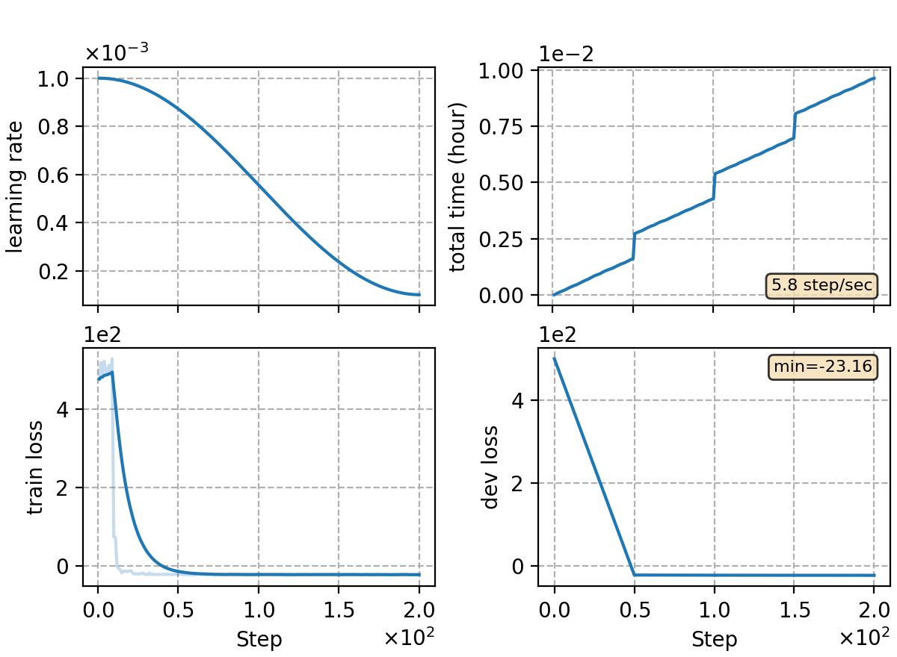

### Basic info

**This part is auto-generated, add your details in Appendix**

* \# of parameters (million): 8.74
* GPU info \[1\]
  * \[1\] NVIDIA GeForce RTX 3090

### Notes

* example of training CTC-CRF model, including den-lm preparation.

### Result
```
yesno   %SER 96.67 | %WER 36.04 [ 173 / 480, 0 ins, 17 del, 156 sub ]
```

|     training process    |
|:-----------------------:|
||
