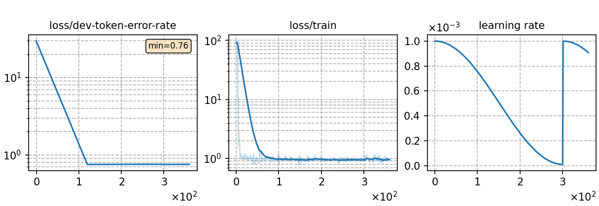

### Basic info

**This part is auto-generated, add your details in Appendix**

* \# of parameters (million): 2.21
* GPU info \[1\]
  * \[1\] NVIDIA GeForce RTX 3090

### Notes

* this template shows how to deal with very large corpora.

### Result
```      
yesno   %SER 100.00 | %WER 64.79 [ 311 / 480, 0 ins, 300 del, 11 sub ]
```

|     training process    |
|:-----------------------:|
||
