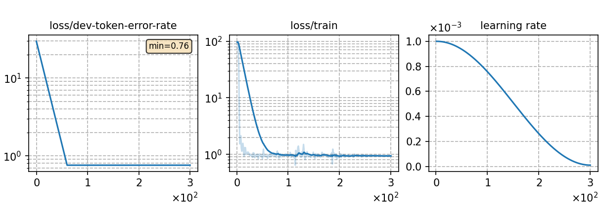

### Basic info

**This part is auto-generated, add your details in Appendix**

* \# of parameters (million): 8.74
* GPU info \[1\]
  * \[1\] NVIDIA GeForce RTX 3090

### Notes

* template experiment using CTC loss to train on the yesno data.

### Result
```
yesno   %SER 100.00 | %WER 53.33 [ 256 / 480, 4 ins, 198 del, 54 sub ]
```

|     training process    |
|:-----------------------:|
||
