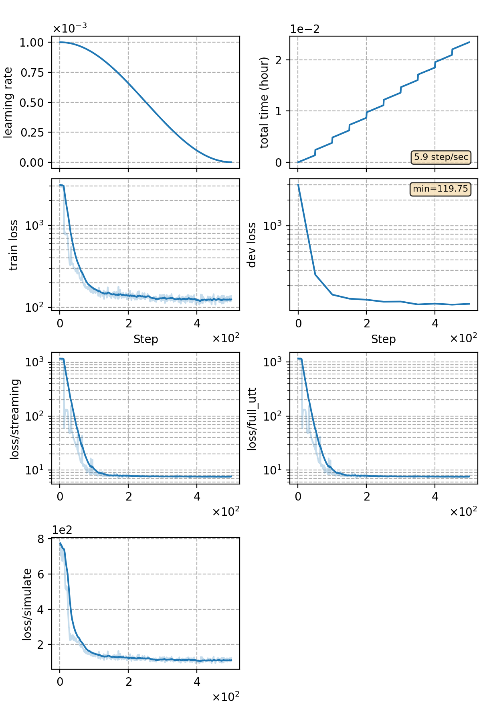

### Basic info

**This part is auto-generated, add your details in Appendix**

* \# of parameters (million): 4.90
* GPU info \[1\]
  * \[1\] NVIDIA GeForce RTX 3090

### Notes

* chunk and streaming experiment
* use LSTM as encoder and there is no subsampling in the encoder.

### Result
```
yesno   %SER 100.00 | %WER 67.92 [ 326 / 480, 0 ins, 317 del, 9 sub ]
```

|     training process    |
|:-----------------------:|
||
