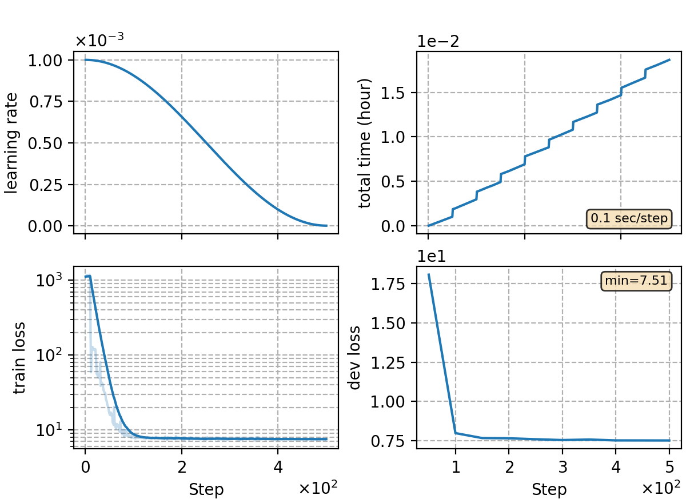

### Basic info

**This part is auto-generated, add your details in Appendix**

* \# of parameters (million): 3.20
* GPU info \[1\]
  * \[1\] NVIDIA GeForce RTX 3090

### Notes

* template experiment using RNN-T loss to train on the yesno data.

### Result
```
yesno   %SER 98.33 | %WER 48.96 [ 235 / 480, 25 ins, 25 del, 185 sub ]
```

|     training process    |
|:-----------------------:|
||
