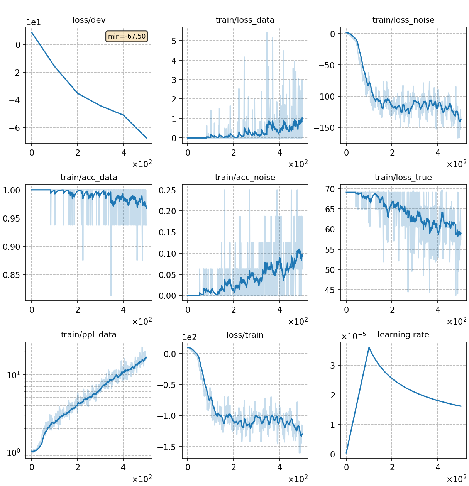

### Basic info

**This part is auto-generated, add your details in Appendix**

* \# of parameters (million): 20.58
* GPU info \[1\]
  * \[1\] NVIDIA GeForce RTX 3090

### Notes

* An example of training energy-based language model.

|     training process    |
|:-----------------------:|
||
