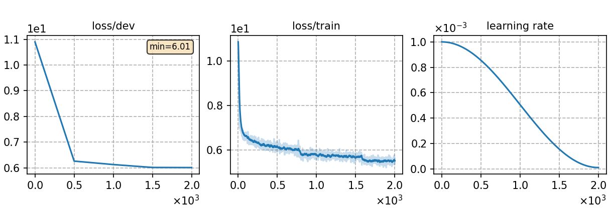

### Basic info

**This part is auto-generated, add your details in Appendix**

* \# of parameters (million): 26.97
* GPU info \[1\]
  * \[1\] NVIDIA GeForce RTX 3090

### Notes

* template experiment training a Transformer LM.

### Result

```
data: data/local-lm/libri-part.dev
ppl:   400.60  |
```

|     training process    |
|:-----------------------:|
||
