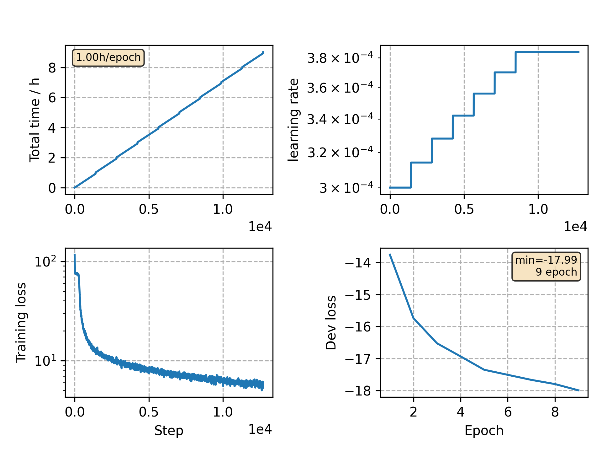

### Basic info

**This part is auto generated, add your details in Appendix**

* Model size/M: 16.82
* GPU info \[5\]
  * \[1\] NVIDIA GeForce GTX 1080 Ti
  * \[4\] NVIDIA GeForce GTX 1080

### Appendix

* This demo shows how to add SpecAug(VGGBLSTM) in training.

### WER
```
%WER 6.26 [ 6563 / 104765, 147 ins, 188 del, 6228 sub ] exp/AUG_VGGBLSTM/decode_test/cer_10_0.0
```

### Monitor figure

