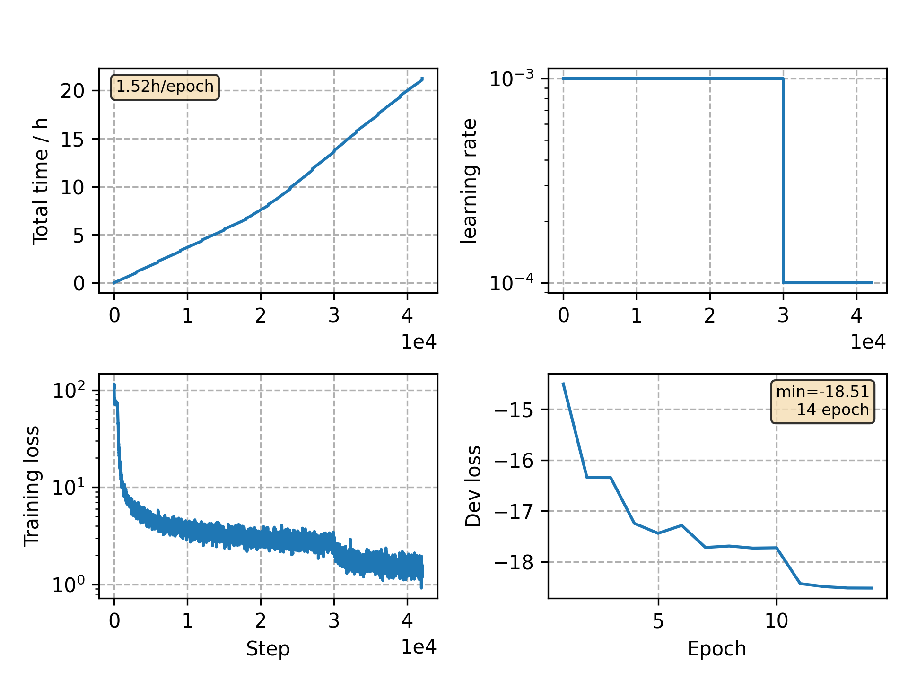

### Basic info

**This part is auto generated, add your details in Appendix**

* Model size/M: 7.08
* GPU info \[5\]
  * \[4\] NVIDIA GeForce GTX 1080
  * \[1\] NVIDIA GeForce GTX 1080 Ti

### Appendix

* This is a demo showing how to train a Conformer model on Aishell dataset.

### WER
```
%WER 5.65 [ 5917 / 104765, 104 ins, 192 del, 5621 sub ] exp/conformer/decode_test/cer_10_0.5
%WER 13.19 [ 8499 / 64428, 644 ins, 1283 del, 6572 sub ] exp/conformer/decode_test/wer_10_0.5

```

### Monitor figure

