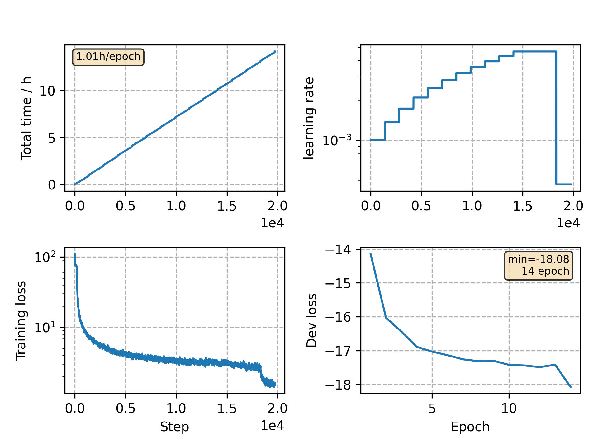

### Basic info

**This part is auto generated, add your details in Appendix**

* Model size/M: 13.58
* GPU info [4]
  * [4] NVIDIA GeForce GTX 1080

### Appendix

* This is a demo showing how to train a BLSTM model on Aishell dataset.

### WER
```
%WER 6.48 [ 6784 / 104765, 127 ins, 228 del, 6429 sub ] exp/BLSTM/decode_test/cer_10_0.5
```

### Monitor figure

