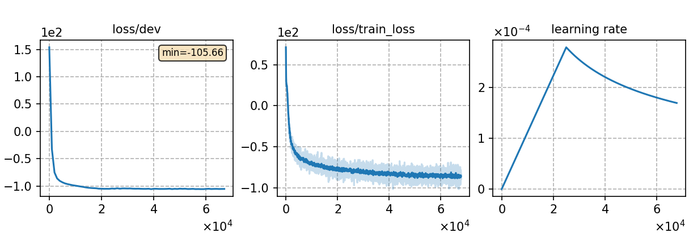

### Basic info

**This part is auto-generated, add your details in Appendix**

* \# of parameters (million): 117.07
* GPU info \[10\]
  * \[10\] NVIDIA GeForce RTX 3090

### Notes

* ctc-crf-cuside training
* use torchaudio for feature extraction w/o CMVN
* This experiment is conducted on the `v3` released code base, and it may slightly differ from the results in [CUSIDE paper](https://arxiv.org/abs/2203.16758).

### Result
```
test    %SER 41.60 | %CER 5.57 [ 5840 / 104765, 137 ins, 105 del, 5598 sub ]/streaming
test    %SER 37.56 | %CER 4.99 [ 5228 / 104765, 142 ins, 115 del, 4971 sub ]/non-streaming
```

|     training process    |
|:-----------------------:|
||
