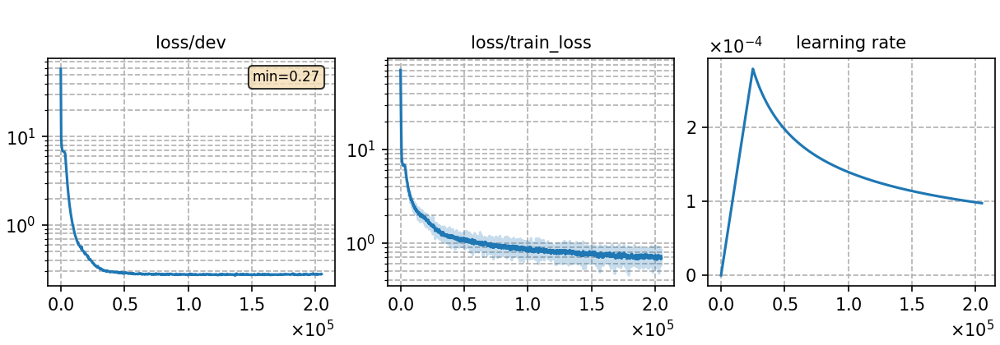

### Basic info

**This part is auto-generated, add your details in Appendix**

* \# of parameters (million): 21.50
* GPU info \[10\]
  * \[10\] NVIDIA GeForce RTX 3090

### Notes

* batch size of 1024 with 200k iters.

### Result
```
dev     %SER 39.24 | %CER 5.24 [ 10752 / 205341, 166 ins, 155 del, 10431 sub ]
test    %SER 41.46 | %CER 5.59 [ 5861 / 104765, 82 ins, 139 del, 5640 sub ]
```

|     training process    |
|:-----------------------:|
||
