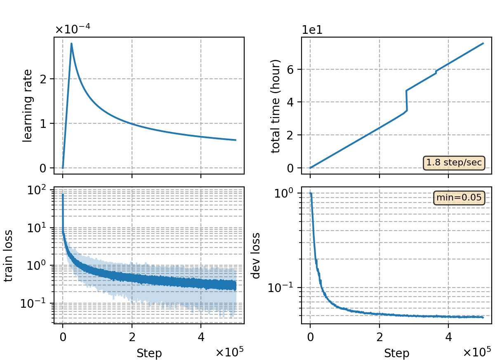

### Basic info

**This part is auto-generated, add your details in Appendix**

* \# of parameters (million): 79.50
* GPU info \[6\]
  * \[6\] NVIDIA GeForce RTX 3090

### Notes

* data prepare

```bash
bash local/data_kaldi.sh /path/to/data -use-3way-sp
```

* same encoder as `rnnt-v1`
* batch size of 128 with 500k iters.

### Result
```
dev     %SER 36.97 | %CER 4.65 [ 9544 / 205341, 167 ins, 144 del, 9233 sub ]
test    %SER 39.62 | %CER 5.21 [ 5462 / 104765, 88 ins, 125 del, 5249 sub ]

+lm-v1-char-5gram 5g char 0.25
dev     %SER 35.08 | %CER 4.49 [ 9211 / 205341, 137 ins, 165 del, 8909 sub ]
test    %SER 37.25 | %CER 4.95 [ 5184 / 104765, 73 ins, 142 del, 4969 sub ]

+lm-v2-word-3gram 3g word 0.3
dev     %SER 33.05 | %CER 4.25 [ 8732 / 205341, 136 ins, 168 del, 8428 sub ]
test    %SER 35.37 | %CER 4.72 [ 4948 / 104765, 71 ins, 143 del, 4734 sub ]
```

|     training process    |
|:-----------------------:|
||
