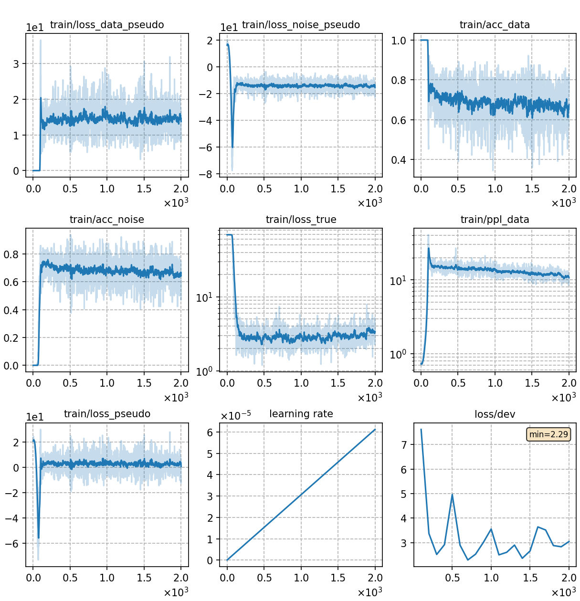

# Train GN-ELM with DNCE

Train the Globally Normalized Energy-based Lanuage Model (GN-ELM) with [DNCE](https://ieeexplore.ieee.org/abstract/document/8639591/).

```bash
python utils/pipeline/lm.py exp/lm/GN-ELM-DNCE
```

## Notes

* You can set **different energy function** in  `config['decoder']['kwargs']['energy_func']`, including 'sumtargetlogit', 'hidden2scalar-sum', 'sumtokenlogit' and so on. Note that different energy functions require **different backbones**, which can be configured in [config_ebm.json](./config_ebm.json). Besides, we need to use an additional language model to generate noise samples, whose structure is specified in [config_noise.json](./config_noise.json).

* For other **ELM experiments with different settings**, we follow the same training framework above and only modify some configurations.
Please refer to
  - [Train GN-ELM with NCE](../GN-ELM-NCE/readme.md)
  - [Train GN-ELM with ML](../GN-ELM-ML/readme.md)
  - [Train TRF-LM with DNCE](../TRF-LM-DNCE/readme.md)

## Result
The trained GN-ELM is capable of rescoring ASR outputs. We rescore two N-best lists generated by [aishell-rnnt](../../../exp/rnnt-v1) (in-domain evaluation) and [wenet-rnnt](../../../../wenetspeech/exp/train_l/rnnt-v1) (cross-domain evaluation). The N-best lists and other test files can be downloaded from [aishell_files](https://cat-ckpt.oss-cn-beijing.aliyuncs.com/liuhong/aishell.tar).

We use [lmweight_search.py](../../../../../cat/utils/lm/lmweight_search.py) to search the best `alpha` and `beta` on dev set, then we use the searched parameters to interpolate the scores of ASR model with the scores of ELM on test set. The script [rescore_aishell.sh](../../../../../cat/utils/rescore_aishell.sh) performs an integrated testing process, where you need to specify the score files of ASR model, LM model and sentence length on dev and test set respectively.

We try 3 different energy functions mentioned in the second note. The backbone of 'sumtargetlogit' is GPT-2, while that of the other two functions is BERT. The results are as follows:

| CER type     | SumTargetLogit | Hidden2Scalar | SumTokenLogit |
| ------------ | -------------- | ------------- | ------------- |
| in-domain    | 3.25           | 3.11          | 3.15          |
| cross-domain | 3.40           | 3.34          | 3.43          |


'Hidden2Scalar' achieves the best results and the training curve is as follows:

|     training curve    |
|:-----------------------:|
||
