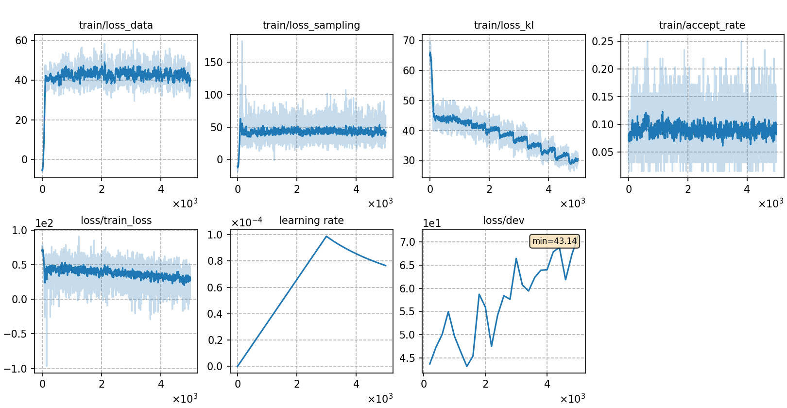

# Train GN-ELM with ML

The training and testing process is basically consistent with [Train GN-ELM with DNCE](../GN-ELM-DNCE/). We only explain the differences here.

## Notes

* During Maximum Likelihood (ML) learning, we need to sample from the ELM. You can try different sampling method by changing the setting `config['decoder']['kwargs']['method']` to `IS` or `MIS`, which correspond to importance sampling and Metropolis independent sampling respectively.

## Result
We also try 3 different energy functions, whose results are as follows:
* ML-IS

|CER type     | SumTargetLogit |  Hidden2Scalar  | SumTokenLogit |
| -------     | -------- | ----------- | ----------- |
| in-domain   | 3.42     |  3.36       |  3.26       |
| cross-domain| 3.61     |  3.48       |  3.41       | 
* ML-MIS

|CER type     | SumTargetLogit |  Hidden2Scalar  | SumTokenLogit |
| -------     | -------- | ----------- | ----------- |
| in-domain   | 3.35     |  3.26       |  3.25       |
| cross-domain| 3.59     |  3.39       |  3.49       | 

The training curve of the best model (ML-MIS with Hidden2Scalar) is shown below.

|     training curve    |
|:-----------------------:|
||
