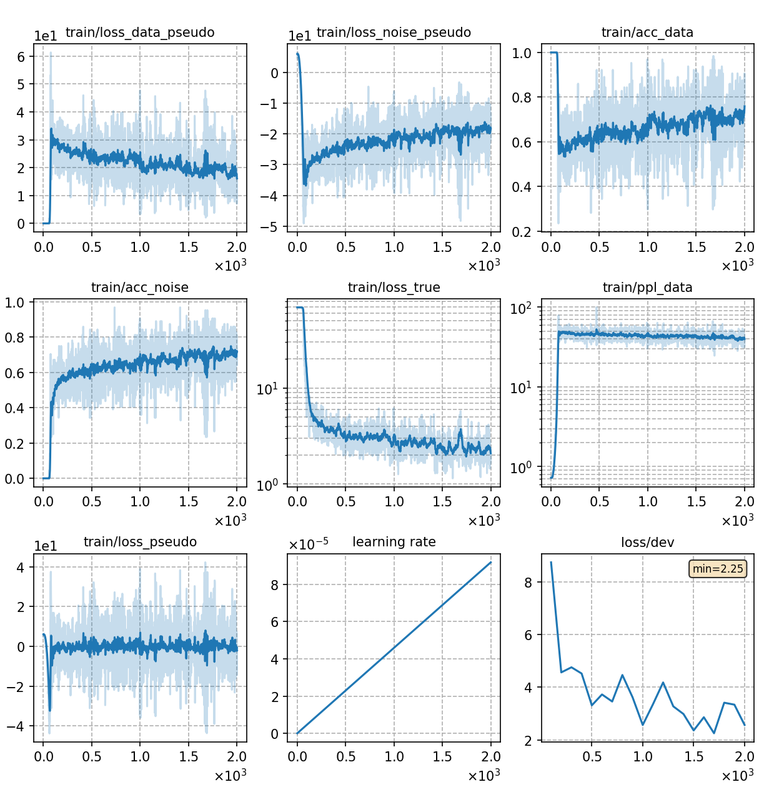

# Train GN-ELM with NCE

The training and testing process is basically consistent with [Train GN-ELM with DNCE](../GN-ELM-DNCE/). We only explain the differences here.

## Notes

* In NCE training (set `config['decoder']['kwargs']['method']=nce`), the noise model is fixed, so we need a  trained language model to initialize the noise model. We use a [finetuned GPT-2](../lm-gpt2/) for initialization, which is specified in `config['decoder']['kwargs']['check_noise_model']`.

## Result

We also try 3 different energy functions, whose results are as follows:

|CER type     | SumTargetLogit |  Hidden2Scalar  | SumTokenLogit |
| -------     | -------- | ----------- | ----------- |
| in-domain   | 3.32     |  3.20       |  3.27       |
| cross-domain| 3.39     |  3.36       |  3.43       | 

The training curve of the best model is shown below.

|     training curve    |
|:-----------------------:|
||
