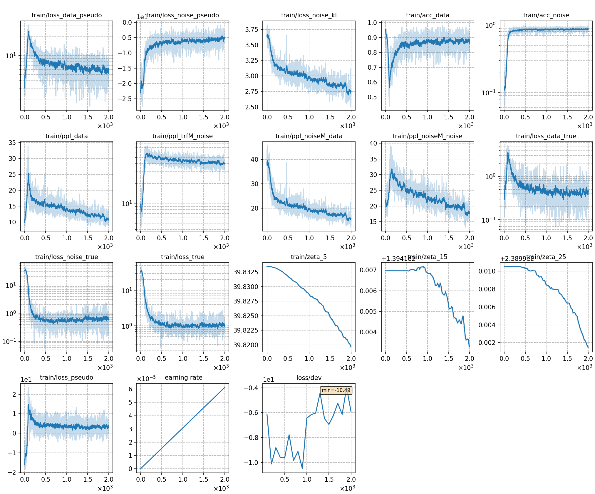

# Train TRF-LM with DNCE
The training and testing process is basically consistent with [Train GN-ELM with DNCE](../GN-ELM-DNCE/). We only explain the differences here.
## Notes
* **In stage 2 (data packing)**, for training TRF, we need to calculate the length distribution after packing data and before training.
```
python -m cat.lm.trf.prep_feats exp/TRF-LM-DNCE/pkl/train.pkl exp/TRF-LM-DNCE/linfo.pkl
```

## Result
We also try 3 different energy functions, whose results are as follows:
|CER type     | SumTargetLogit |  Hidden2Scalar  | SumTokenLogit |
| -------     | -------- | ----------- | ----------- |
| in-domain   | 3.11     |  3.13       |  3.21       |
| cross-domain| 3.44     |  3.39       |  3.47       | 

The training curve of the best model is shown below.
|     training curve    |
|:-----------------------:|
||