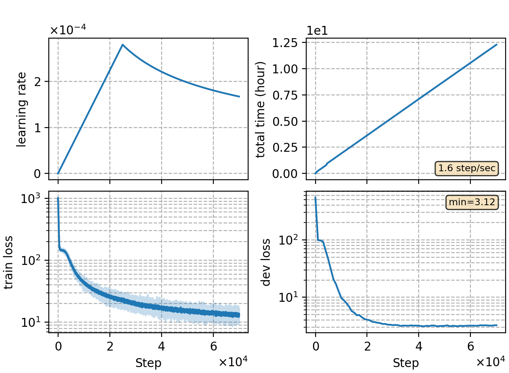

### Basic info

**This part is auto-generated, add your details in Appendix**

* Model size/M: 84.30
* GPU info \[10\]
  * \[10\] NVIDIA GeForce RTX 3090

### Notes

* data prepare

```bash
bash local/data.sh /path/to/data -sp 1.1 0.9
```

* use torchaudio for feature extraction w/o CMVN

### Result

```
beamwidth=16
dev     %SER 33.79 | %CER 4.43 [ 9104 / 205341, 154 ins, 250 del, 8700 sub ]
test    %SER 35.14 | %CER 4.76 [ 4989 / 104765, 68 ins, 195 del, 4726 sub ]

fusion 5gram char lm alpha=0.15 beta=0.5 beamwidth=16
thaudio-dev     %SER 32.93 | %CER 4.35 [ 8930 / 205341, 147 ins, 325 del, 8458 sub ]
thaudio-test    %SER 34.43 | %CER 4.69 [ 4912 / 104765, 63 ins, 229 del, 4620 sub ]

rescore with 3gram word lm alpha=0.28 beta=-0.5 beamwidth=16
dev     %SER 31.75 | %CER 4.25 [ 8729 / 205341, 123 ins, 635 del, 7971 sub ]
test    %SER 32.78 | %CER 4.47 [ 4688 / 104765, 45 ins, 404 del, 4239 sub ]

5gram char + LODR: ilm=-0.3125 elm=0.28125
dev     %SER 32.40 | %CER 4.16 [ 8548 / 205341, 169 ins, 191 del, 8188 sub ]
test    %SER 34.18 | %CER 4.49 [ 4706 / 104765, 81 ins, 147 del, 4478 sub ]

3gram word lm + LODR: ilm=-0.3125 elm=0.28125
dev     %SER 30.60 | %CER 3.93 [ 8072 / 205341, 152 ins, 215 del, 7705 sub ]
test    %SER 32.27 | %CER 4.22 [ 4422 / 104765, 68 ins, 177 del, 4177 sub ]
```

### Monitor figure

