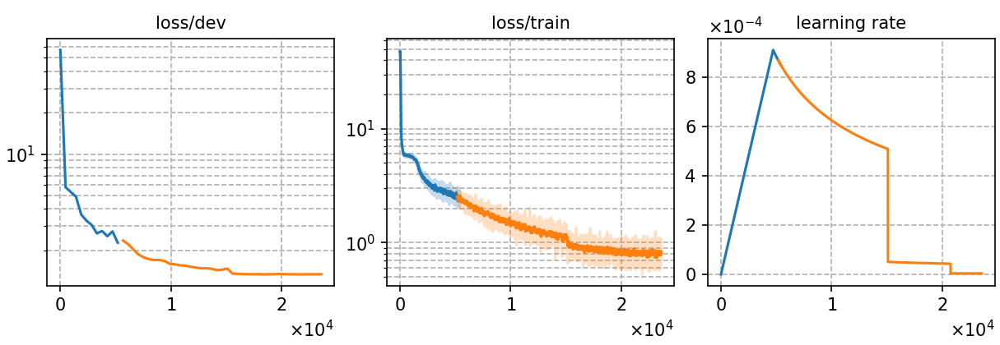

### Basic info

**This part is auto-generated, add your details in Appendix**

* \# of parameters (million): 20.70
* GPU info \[2\]
  * \[2\] NVIDIA GeForce RTX 3090

### Notes

* Choose channel 0 as input_channel

### Result
```
Streaming:
test_raw_ori    %SER 98.02 | %CER 55.07 [ 72303 / 131298, 2006 ins, 25601 del, 44696 sub ]
-------------------------
Non-streaming
test_raw_ori    %SER 91.26 | %CER 38.76 [ 50886 / 131298, 4611 ins, 6505 del, 39770 sub ]

```

|     training process    |
|:-----------------------:|
||
