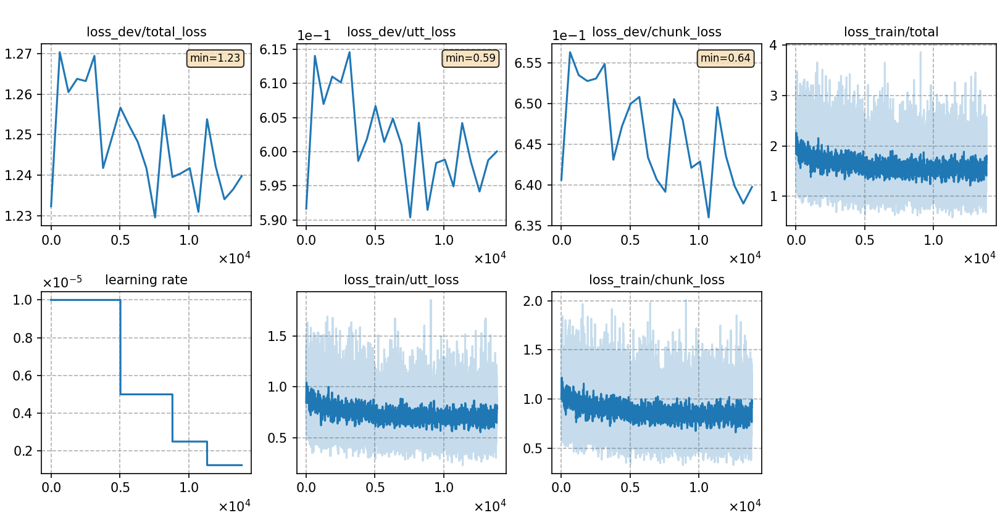

### Basic info

**This part is auto-generated, add your details in Appendix**

* \# of parameters (million): 85.79
* GPU info \[4\]
  * \[4\] NVIDIA GeForce RTX 3090

### Notes

* 

### Result

#### Add 12.9h Simu-Data (Exp 10)
```
Streaming
test_alimeeting_raw_ori %SER 64.73 | %CER 18.04 [ 11040 / 61184, 750 ins, 2327 del, 7963 sub ]
dev_alimeeting_raw_ori  %SER 66.65 | %CER 19.11 [ 3679 / 19256, 332 ins, 795 del, 2552 sub ]
test_raw_ori    %SER 77.94 | %CER 17.49 [ 22967 / 131298, 4061 ins, 3076 del, 15830 sub ]
test_706_array_raw_ori  %SER 90.00 | %CER 25.84 [ 261 / 1010, 12 ins, 23 del, 226 sub ]
-----------------------
Non-streaming
test_alimeeting_raw_ori %SER 57.95 | %CER 13.90 [ 8503 / 61184, 543 ins, 2013 del, 5947 sub ]
dev_alimeeting_raw_ori  %SER 60.01 | %CER 14.96 [ 2881 / 19256, 260 ins, 707 del, 1914 sub ]
test_raw_ori    %SER 73.01 | %CER 14.14 [ 18565 / 131298, 3460 ins, 2688 del, 12417 sub ]
test_706_array_raw_ori  %SER 92.50 | %CER 20.69 [ 209 / 1010, 4 ins, 22 del, 183 sub ]

```

#### Add 12.9h + 60h Simu-Data (Exp 11)
```
Streaming
test_alimeeting_raw_ori %SER 65.05 | %CER 18.17 [ 11119 / 61184, 616 ins, 2744 del, 7759 sub ]
dev_alimeeting_raw_ori  %SER 66.82 | %CER 19.11 [ 3680 / 19256, 277 ins, 932 del, 2471 sub ]
test_raw_ori    %SER 79.20 | %CER 18.06 [ 23716 / 131298, 3766 ins, 3737 del, 16213 sub ]
test_706_array_raw_ori  %SER 95.00 | %CER 30.10 [ 304 / 1010, 9 ins, 47 del, 248 sub ]
-----------------------
Non-streaming
test_alimeeting_raw_ori %SER 57.22 | %CER 13.65 [ 8349 / 61184, 518 ins, 1902 del, 5929 sub ]
dev_alimeeting_raw_ori  %SER 58.28 | %CER 14.36 [ 2765 / 19256, 239 ins, 715 del, 1811 sub ]
test_raw_ori    %SER 73.97 | %CER 14.46 [ 18984 / 131298, 3428 ins, 2757 del, 12799 sub ]
test_706_array_raw_ori  %SER 90.00 | %CER 21.19 [ 214 / 1010, 2 ins, 21 del, 191 sub ]

```

#### Add 12.9h + 60h + 79h Simu-Data (Exp 12)
```
Streaming
test_alimeeting_raw_ori %SER 73.11 | %CER 21.54 [ 13176 / 61184, 454 ins, 5147 del, 7575 sub ]
dev_alimeeting_raw_ori  %SER 73.80 | %CER 22.26 [ 4286 / 19256, 204 ins, 1724 del, 2358 sub ]
test_raw_ori    %SER 84.21 | %CER 20.67 [ 27141 / 131298, 3100 ins, 7943 del, 16098 sub ]
test_706_array_raw_ori  %SER 95.00 | %CER 33.27 [ 336 / 1010, 5 ins, 105 del, 226 sub ]
-----------------------
Non-streaming
test_alimeeting_raw_ori %SER 57.40 | %CER 13.93 [ 8525 / 61184, 483 ins, 1948 del, 6094 sub ]
dev_alimeeting_raw_ori  %SER 59.26 | %CER 14.61 [ 2813 / 19256, 226 ins, 747 del, 1840 sub ]
test_raw_ori    %SER 74.11 | %CER 14.62 [ 19199 / 131298, 3257 ins, 2940 del, 13002 sub ]
test_706_array_raw_ori  %SER 90.00 | %CER 21.39 [ 216 / 1010, 2 ins, 17 del, 197 sub ]
```

|     training process    |
|:-----------------------:|
||
