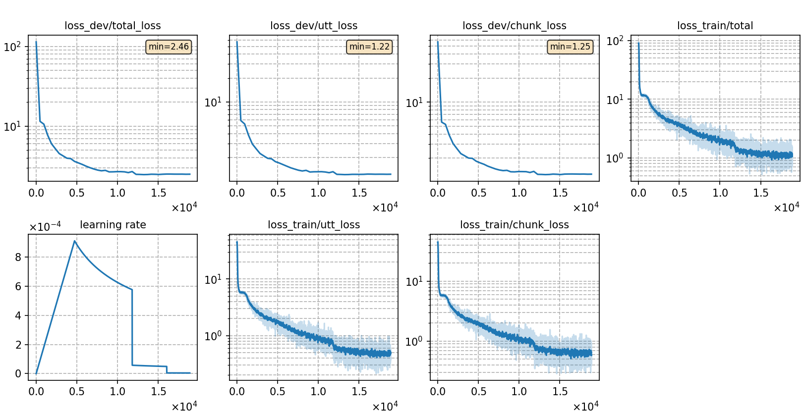

### Basic info

**This part is auto-generated, add your details in Appendix**

* \# of parameters (million): 20.70
* GPU info \[4\]
  * \[4\] NVIDIA GeForce RTX 3090

### Notes

* 

### Result
```
Streaming
test_alimeeting_raw_ori %SER 88.66 | %CER 46.26 [ 28303 / 61184, 1853 ins, 4777 del, 21673 sub ]
dev_alimeeting_raw_ori  %SER 89.67 | %CER 50.10 [ 9647 / 19256, 663 ins, 1637 del, 7347 sub ]
test_raw_ori    %SER 92.55 | %CER 40.95 [ 53763 / 131298, 5404 ins, 6951 del, 41408 sub ]
test_706_array_raw_ori  %SER 100.00 | %CER 87.33 [ 882 / 1010, 7 ins, 583 del, 292 sub ]
-------------------------
Non-streaming
test_alimeeting_raw_ori %SER 84.43 | %CER 41.23 [ 25224 / 61184, 1240 ins, 4102 del, 19882 sub ]
dev_alimeeting_raw_ori  %SER 85.63 | %CER 45.00 [ 8665 / 19256, 524 ins, 1363 del, 6778 sub ]
test_raw_ori    %SER 90.32 | %CER 36.17 [ 47496 / 131298, 4587 ins, 6178 del, 36731 sub ]
test_706_array_raw_ori  %SER 100.00 | %CER 86.34 [ 872 / 1010, 2 ins, 647 del, 223 sub ]
```

|     training process    |
|:-----------------------:|
||
