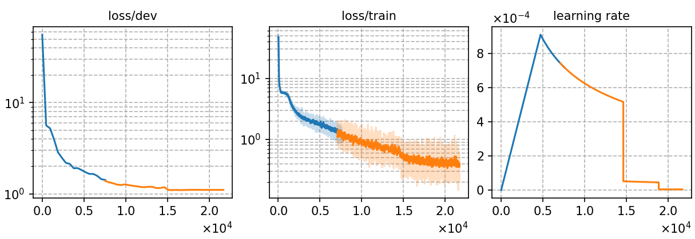

### Basic info

**This part is auto-generated, add your details in Appendix**

* \# of parameters (million): 25.77
* GPU info \[2\]
  * \[2\] NVIDIA GeForce RTX 3090

### Notes

* 

### Result
```
Streaming
test_raw_ori    %SER 98.55 | %CER 56.84 [ 74626 / 131298, 2181 ins, 30414 del, 42031 sub ]
-----------------------
Non-streaming
test_raw_ori    %SER 88.28 | %CER 27.93 [ 36673 / 131298, 3925 ins, 4613 del, 28135 sub ]
```

|     training process    |
|:-----------------------:|
||
