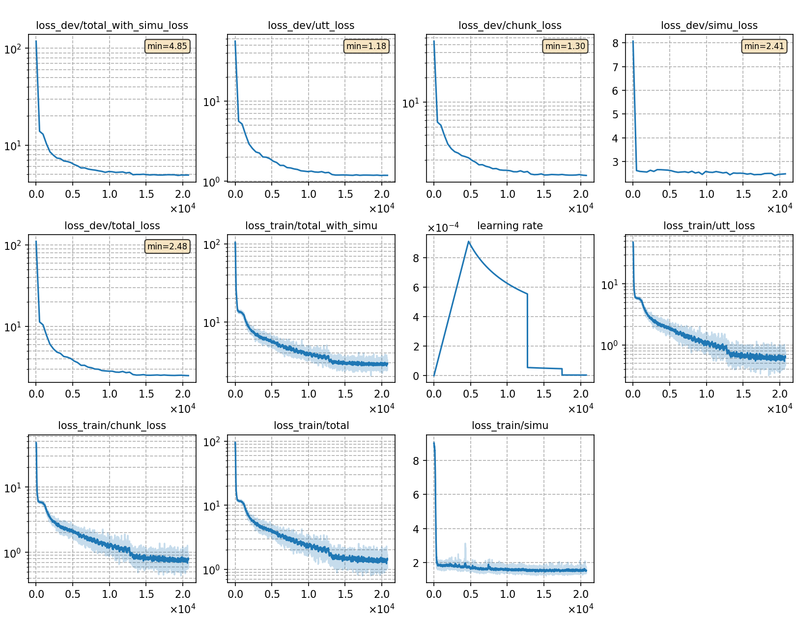

### Basic info

**This part is auto-generated, add your details in Appendix**

* \# of parameters (million): 27.64
* GPU info \[4\]
  * \[4\] NVIDIA GeForce RTX 3090

### Notes

* 

### Result
```
Streaming
test_raw_ori    %SER 90.56 | %CER 35.96 [ 47215 / 131298, 4954 ins, 5610 del, 36651 sub ]
-----------------------
Non-streaming
test_raw_ori    %SER 89.39 | %CER 31.70 [ 41623 / 131298, 4432 ins, 4906 del, 32285 sub ]
```

|     training process    |
|:-----------------------:|
||
