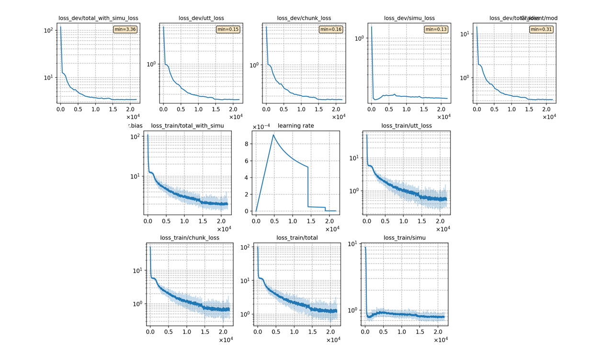
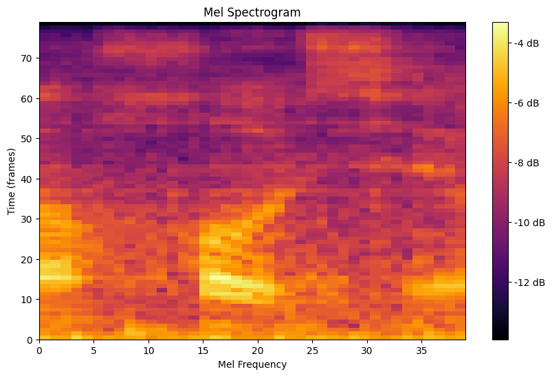
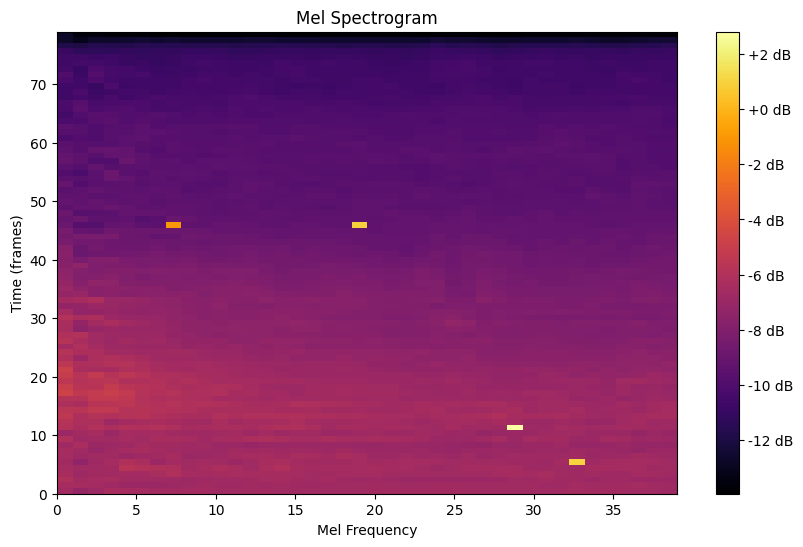

### Basic info

**This part is auto-generated, add your details in Appendix**
```
 < 400000
==================== Stage 2 Pickle data====================
pack_data(): remove 1795 unqualified sequences.
# of frames: 2502494445 | tokens: 652320 | seqs: 33930
# of frames: 133634226 | tokens: 34632 | seqs: 1881 


 < 160000
==================== Stage 2 Pickle data====================
pack_data(): remove 4330 unqualified sequences.
# of frames: 2004997055 | tokens: 520118 | seqs:31395
# of frames: 133634226 | tokens: 34632 | seqs: 1881  
```
### Notes

* data prepare
```bash
bash local/data_multi.sh -subsets train dev test -datapath /path/to/aishell4 
bash local/audio2ark_multi.sh train dev test --res 16000
```

### Result
```
Streaming：
dev_raw         %SER 79.80 | %CER 22.60 [ 7822 / 34613, 905 ins, 1197 del, 5720 sub ]
test_raw        %SER 90.48 | %CER 32.18 [ 42248 / 131298, 4703 ins, 5034 del, 32511 sub ]
Non-streaming：
dev_raw         %SER 76.13 | %CER 19.74 [ 6832 / 34613, 768 ins, 1064 del, 5000 sub ]
test_raw        %SER 88.13 | %CER 28.70 [ 37684 / 131298, 4070 ins, 4662 del, 28952 sub ]
```

|     training process    |
|:-----------------------:|
||

|     real right context   |
|:-----------------------:|
||

|     simu right context   |
|:-----------------------:|
||

