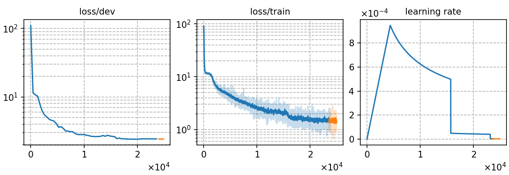

### Basic info

**This part is auto-generated, add your details in Appendix**

``` 
< 400000
==================== Stage 2 Pickle data====================
pack_data(): remove 1795 unqualified sequences.
# of frames: 2502494445 | tokens: 652320 | seqs: 33930
# of frames: 133634226 | tokens: 34632 | seqs: 1881 


 < 160000
==================== Stage 2 Pickle data====================
pack_data(): remove 4330 unqualified sequences.
# of frames: 2004997055 | tokens: 520118 | seqs:31395
# of frames: 133634226 | tokens: 34632 | seqs: 1881  
```

### Notes

* data prepare
```bash
bash local/data_multi.sh -subsets train dev test -datapath /path/to/aishell4 
bash local/audio2ark_multi.sh train dev test --res 16000
```

### Result
best-10
```
Streaming: 
dev_raw         %SER 81.18 | %CER 24.12 [ 8348 / 34613, 879 ins, 1344 del, 6125 sub ]
test_raw        %SER 91.19 | %CER 34.14 [ 44828 / 131298, 4699 ins, 5654 del, 34475 sub ]   

Non-streaming:
dev_raw         %SER 76.40 | %CER 19.26 [ 6666 / 34613, 833 ins, 1007 del, 4826 sub ]
test_raw        %SER 88.12 | %CER 28.27 [ 37113 / 131298, 4136 ins, 4405 del, 28572 sub ]
```
|     training process    |
|:-----------------------:|
||


