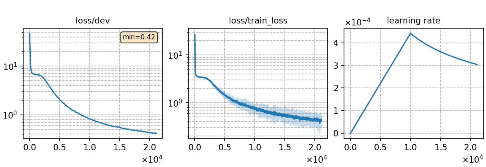

### Basic info

**This part is auto-generated, add your details in Appendix**

* \# of parameters (million): 46.51
* GPU info \[10\]
  * \[10\] NVIDIA GeForce RTX 3090

### Notes

* use torchaudio for feature extraction w/o CMVN
* please note that `add_dummy_prefix = false` in tokenizer training setting of SentencePiece tokenizer is erroneous, but would probably only introduce minor differences to results.

### Result
```
dev     %SER 59.08 | %WER 16.22 [ 13632 / 84022, 1105 ins, 2330 del, 10197 sub ]
test    %SER 63.25 | %WER 19.50 [ 15970 / 81896, 1233 ins, 2868 del, 11869 sub ]
```

|     training process    |
|:-----------------------:|
||
