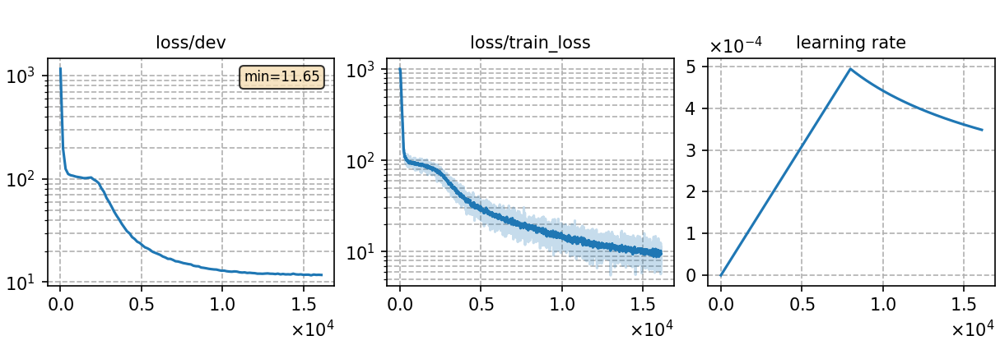

### Basic info

**This part is auto-generated, add your details in Appendix**

* \# of parameters (million): 53.01
* GPU info \[10\]
  * \[10\] NVIDIA GeForce RTX 3090

### Notes

* use torchaudio for feature extraction w/o CMVN

### Result
```
dev     %SER 66.03 | %CER 18.14 [ 31626 / 174359, 860 ins, 11275 del, 19491 sub ]
test    %SER 73.29 | %CER 17.14 [ 29549 / 172400, 975 ins, 4791 del, 23783 sub ]
```

|     training process    |
|:-----------------------:|
||
