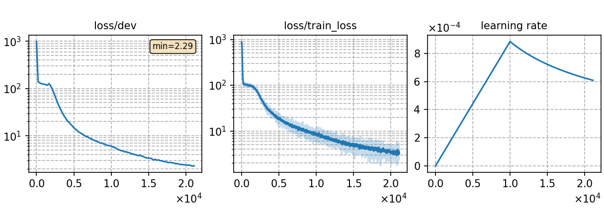

### Basic info

**This part is auto-generated, add your details in Appendix**

* \# of parameters (million): 50.43
* GPU info \[10\]
  * \[10\] NVIDIA GeForce RTX 3090

### Notes

* use torchaudio for feature extraction w/o CMVN
* please note that `add_dummy_prefix = false` in tokenizer training setting of SentencePiece tokenizer is erroneous, but would probably only introduce minor differences to results.

### Result
```
dev     %SER 29.11 | %WER 6.44 [ 5412 / 84022, 437 ins, 1061 del, 3914 sub ]
test    %SER 33.46 | %WER 8.55 [ 7001 / 81896, 553 ins, 1566 del, 4882 sub ]
```

|     training process    |
|:-----------------------:|
||
