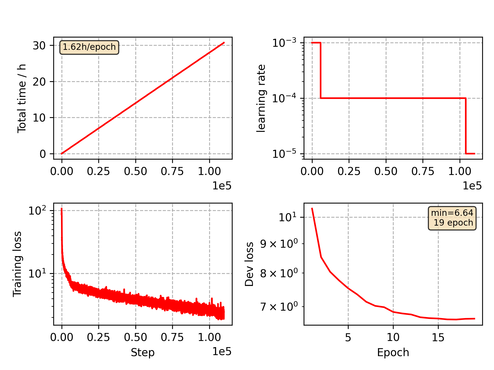

### Basic info

**This part is auto generated, add your details in Appendix**

* Model size/M: 16.70
* GPU info \[4\]
  * \[4\] NVIDIA GeForce GTX 1080

### Appendix

* Based on CommonVoice Belarusian VGGBLSTM model training

### WER
```
%WER 8.20 [ 10574 / 128987, 239 ins, 7406 del, 2929 sub ] exp/VGG/decode_test/wer_14_0.0
```

### Monitor figure

