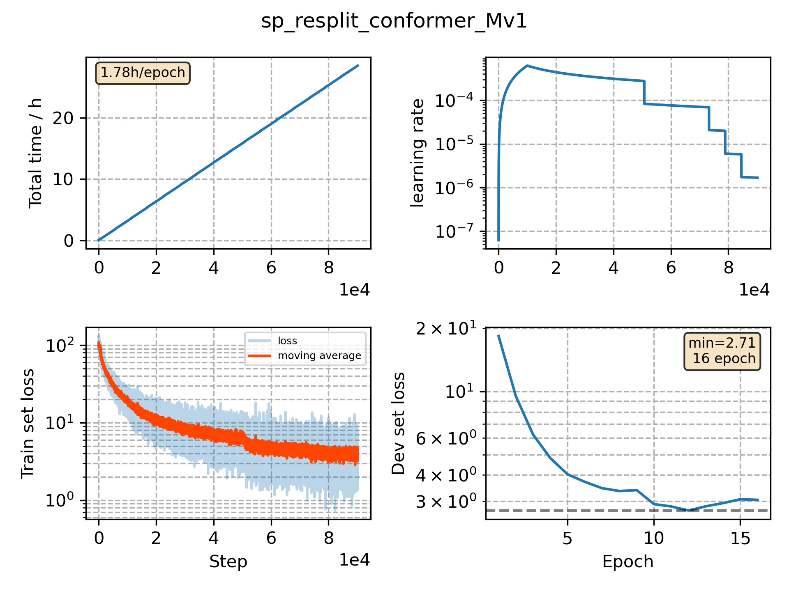

### Basic info

**This part is auto generated, add your details in Appendix**

* Model size/M: 25.03
* GPU info \[8\]
  * \[8\] Tesla P100-SXM2-16GB

### Appendix

* resample the original dataset

### WER
```
%WER 10.71 [ 14729 / 137510, 2317 ins, 3379 del, 9033 sub ] exp/sp_resplit_conformer_Mv1//decode_test_de_bd_fgconst/wer_10_0.5
```

### Monitor figure

