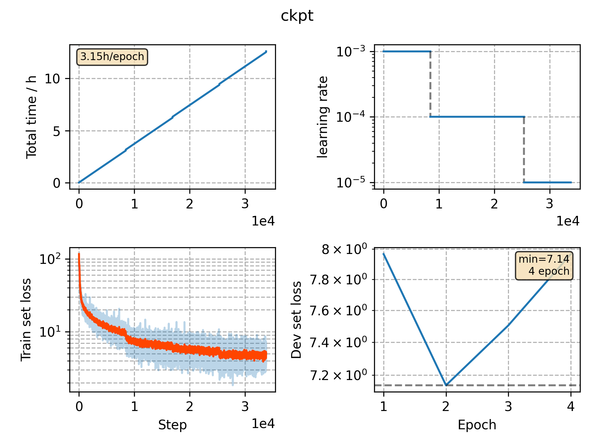

### Basic info

**This part is auto generated, add your details in Appendix**

* Model size/M: 69.64
* GPU info \[3\]
  * \[3\] Tesla P100-PCIE-16GB

### Appendix

* 

### WER

- WER 23.33 [ 32180 / 137927, 2737 ins, 4431 del, 25012 sub ] exp/cv_fr_phone_vggblstm/decode_fr_test_bd_tgpr/wer_11_1.0
- WER 19.53 [ 26939 / 137927, 2340 ins, 3762 del, 20837 sub ] exp/cv_fr_phone_vggblstm/decode_fr_test_bd_fgconst/wer_12_1.0

### Monitor figure

