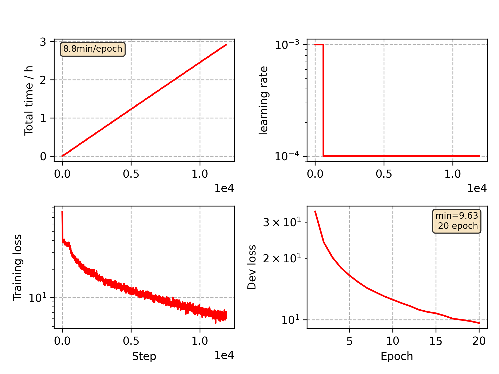

### Basic info

**This part is auto generated, add your details in Appendix**

* Model size/M: 16.74
* GPU info \[4\]
  * \[4\] NVIDIA GeForce GTX 1080

### Appendix

* Based on CommonVoice Hongkong VGGBLSTM model training

### WER
```
%WER 16.30 [ 913 / 5600, 58 ins, 274 del, 581 sub ] exp/VGG/decode_test/wer_9_1.0
```

### Monitor figure

