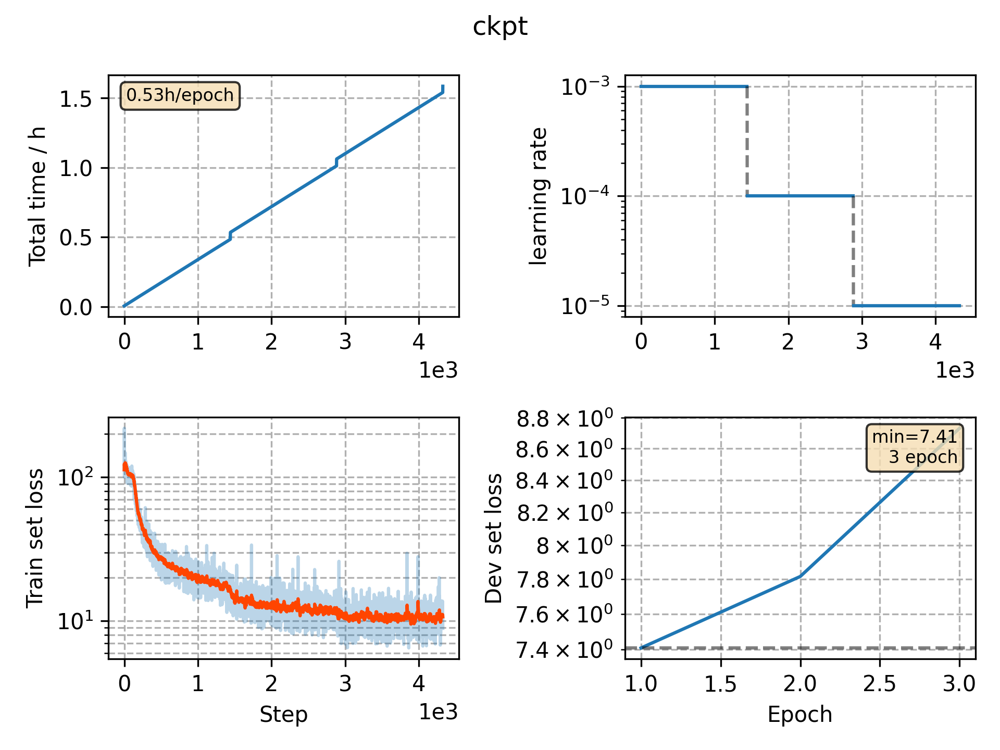

### Basic info

**This part is auto generated, add your details in Appendix**

* Model size/M: 69.59
* GPU info \[3\]
  * \[3\] Tesla P100-PCIE-16GB

### Appendix

* 

### WER

- WER 26.30 [ 30795 / 117099, 3293 ins, 6064 del, 21438 sub ] exp/cv_it_phone_vggblstm/decode_it_test_bd_tgpr/wer_11_1.0
- WER 23.47 [ 27485 / 117099, 3212 ins, 5002 del, 19271 sub ] exp/cv_it_phone_vggblstm/decode_it_test_bd_fgconst/wer_11_1.0

### Monitor figure

