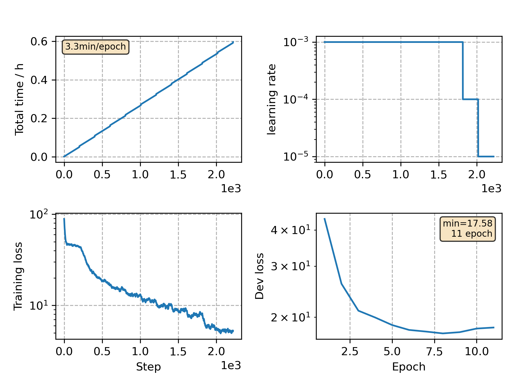

### Basic info

**This part is auto generated, add your details in Appendix**

* Model size/M: 16.69
* GPU info \[2\]
  * \[2\] Tesla P100-PCIE-16GB

### Appendix

* Based on CommonVoice Japanese VGGBLSTM model training

### WER
```
%WER 16.04 [ 723 / 4508, 128 ins, 57 del, 538 sub ] exp/VGG/decode_test/wer_16_1.0
```

### Monitor figure

