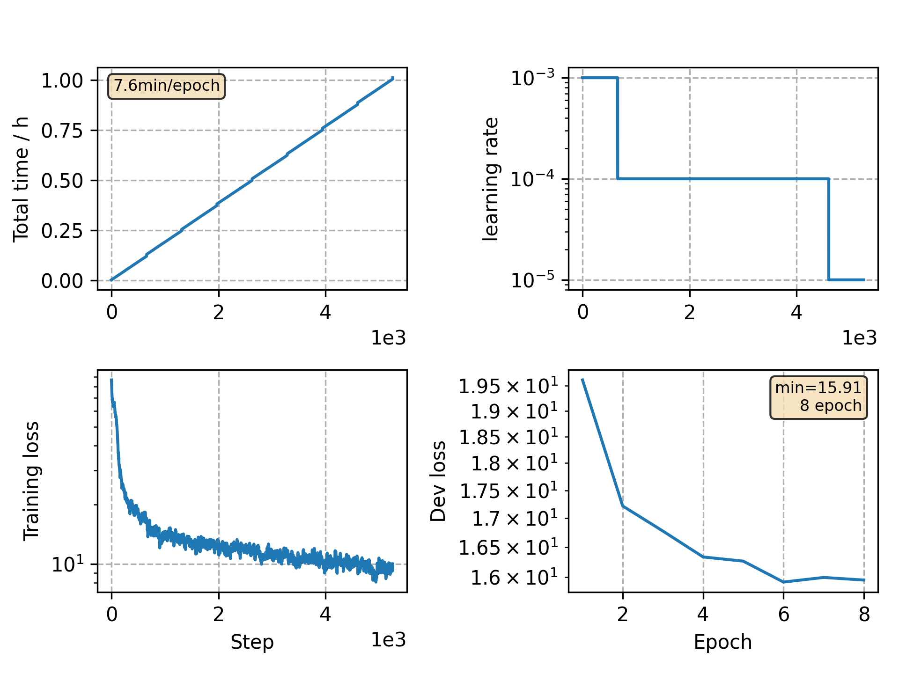

### Basic info

**This part is auto generated, add your details in Appendix**

* Model size/M: 16.70
* GPU info \[5\]
  * \[4\] NVIDIA GeForce GTX 1080
  * \[1\] NVIDIA GeForce GTX 1080 Ti

### Appendix

* Based on CommonVoice Portuguese VGGBLSTM model training 

### WER
```
%WER 6.40 [ 3757 / 58714, 413 ins, 930 del, 2414 sub ] exp/VGG/decode_test/wer_14_0.0
```

### Monitor figure

